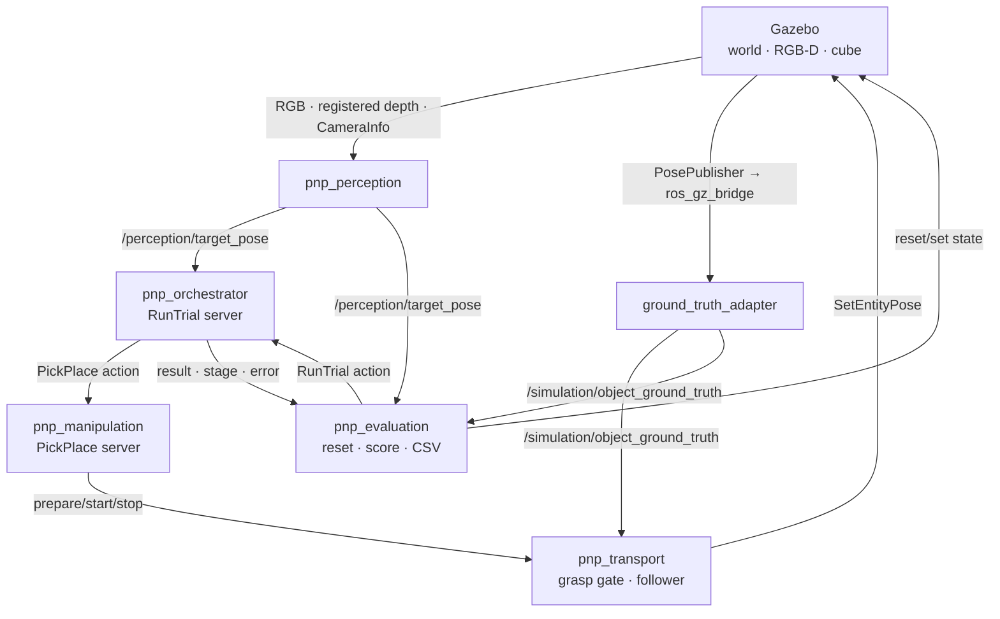

# 2026 여름 픽앤플레이스 스터디
## 최종 실행 커리큘럼 v3.2 — ROS 2 · Gazebo · MoveIt · RGB-D 통합

> **기간:** 시작 전 Week 0 + 본과정 4주  
> **인원:** 2명  
> **운영 권장:** 주 3회, 회차당 2.5~3.5시간 + 회차 사이 개인 정리 1~2시간 (Week 2만 4회차)  
> **환경:** Windows + WSL2 + ROBOTIS 공식 Docker 환경  
> **로봇:** OpenMANIPULATOR-X 시뮬레이션 모델  
> **최종 목표:** RGB-D 카메라로 물체를 찾고, MoveIt으로 경로를 계획하여, Gazebo에서 물체를 집어 지정 위치에 놓는 과정을 반복 실행 가능한 ROS 2 시스템으로 완성한다.

---

# Quick Start

이 문서는 기술 선택 회의록이 아니라 **순서대로 실행하는 커리큘럼**이다. 회차마다 「목표 · 실습 · 완료 기준」을 먼저 읽고, 막혔을 때만 「실패 시」를 펼친다. 모든 회차의 종료 조건은 “읽었다”가 아니라 **다른 사람이 재현할 수 있는 결과를 남겼다**이다.

## 바로 확인할 것

Week 1을 시작하기 전에 다음 네 가지를 `docs/setup/week0_spike.md`에 고정한다.

| 고정 항목 | 확인 방법 | 기록값 |
|---|---|---|
| `ik_mode` | effective MoveIt parameter와 position-only/full-pose 비교 | `position-only` 또는 `full-pose` |
| `planning_frame` | `move_group.getPlanningFrame()` | 런타임 출력 |
| `reset_backend` | pose와 twist를 함께 초기화할 수 있는 경로 시험 | `set_entity_state` · `respawn` · `custom_reset` 중 하나 |
| RGB-depth 좌표계 | 해상도·registration·CameraInfo·optical frame 시험 | 역투영에 쓸 image/CameraInfo/frame |

이 네 값은 문서의 예시 이름보다 **실제 런타임 결과가 우선**이다. 특히 `position_only_ik`는 설치된 ROBOTIS commit과 생성된 MoveIt parameter를 직접 확인한다. 소스 YAML에 키가 없거나 다른 값이 있어도 추측으로 보충하지 않는다.

## 프레임 고정표

| 의미 | 고정 규칙 |
|---|---|
| `planning_frame` | 런타임에서 `getPlanningFrame()`으로 확인. 목표 pose와 평가 좌표의 기본 기준 |
| `arm_base_frame` | 공식 모델의 `link1`. `joint1` 방위각과 base yaw 계산의 기준 |
| `eef_frame` | `end_effector_link` |
| `grasp_frame` | 프로젝트가 정의. 접근축과 목표 axial offset을 함께 기록 |
| `camera_optical_frame` | Session 5에서 이름을 확정하고 Session 7에서 optical 축 규약 검증 |
| `world_frame` | 공식 모델의 `world` |

공식 URDF에는 `base_link`가 없다. 따라서 목표 pose를 기계적으로 `link1` 기준으로 보내지도 않는다. **목표 pose와 카메라 변환 목적지는 `planning_frame`, base yaw 계산은 `link1`/`joint1` 원점 기준**으로 분리한다.

## fallback 용어표

| 코드 | 의미 |
|---|---|
| `F0` | ROS·Gazebo·MoveIt·비전·평가를 모두 경험하는 균형 완주형 |
| `L2` | T1 운반과 최소 20회 평가까지 수행하는 표준 완료 수준 |
| `L1-fallback` | T0 운반으로 축소하고 최소 10회 평가하는 완료 수준 |
| `E2` | ROBOTIS 공식 Docker 환경 |
| `E1` | Docker GUI 복구가 불가능할 때만 쓰는 host 설치 비상 경로 |
| `M3` | MoveGroupInterface C++ 조작 |
| `P1` | HSV + registered depth 인식 |
| `P2` | 원인별 센서 fallback. AprilTag의 위치 성분 또는 고정 intrinsics 등을 사용 |
| `P0` | Gazebo ground truth. 실행 pose 생성·보정에는 사용 금지 |
| `T1` | EE pose를 따라 물체 pose를 연속 갱신 |
| `T0` | pick/place 결과 시점에만 물체 pose를 갱신하는 운반 fallback |

최종 결과에는 반드시 다음을 기록한다.

```text
completion_level: L2 | L1-fallback
perception_mode: P1 | P2
transport_mode: T1 | T0
ik_mode: position-only | full-pose
```

## 최소 완주 경로

| 주차 | 최소한 이것 |
|---|---|
| Week 0 | Docker · Gazebo/RViz · spike 3종 · 프레임/IK/reset/RGB-D 계약 동결 |
| Week 1 | 상위 launch 하나 · action cancel/timeout · TF tree와 상태기계 소유권 설명 |
| Week 2 | 고정 좌표 pick-place · 잘못된 파지를 grasp gate가 거부 · T1 또는 T0 |
| Week 3 | 센서 좌표로 pick-place · P1 또는 문서화된 P2 · 오류 코드 분류 |
| Week 4 | reset 후 자동 반복 · L2 20회 또는 L1-fallback 10회 CSV · README 재실행 |

## 목차

- [1. 확정 구성](#1-확정-구성)
- [2. 최종 결과물과 성공 기준](#2-최종-결과물과-성공-기준)
- [3. 핵심 용어](#3-처음-등장하는-핵심-용어)
- [4. 시스템 구조와 인터페이스](#4-시스템-구조)
- [6. Week 0](#6-week-0--환경-구축과-위험-제거)
- [7. Week 1](#7-week-1--ros-2-시스템-뼈대)
- [8. Week 2](#8-week-2--moveit-조작과-고정-좌표-픽앤플레이스)
- [9. Week 3](#9-week-3--p1-hsv--depth-인식)
- [10. Week 4](#10-week-4--신뢰성-평가-최종-정리)
- [12. 진단표](#12-예상-문제와-진단-순서)
- [13. Gate 요약](#13-week별-gate-요약)
- [15. 최종 체크리스트](#15-최종-체크리스트)
- [18. 개정 이력](#18-개정-이력)

---

# 1. 확정 구성

| 구분 | 확정 내용 | 이번 스터디에서의 의미 |
|---|---|---|
| 전체 방향 | **F0 · 균형 완주형** | ROS 시스템, 시뮬레이션, MoveIt, RGB-D 비전, 평가를 모두 한 번씩 경험 |
| 난이도 | **L2 · 표준** | 기본 목표. T1 운반, 오류 처리, 1회 재시도, 최소 20회 평가 |
| 실행 환경 | **ROBOTIS 공식 Docker 환경** | 의존성이 준비된 컨테이너에서 ROS 2 Jazzy와 OpenMANIPULATOR-X 패키지 사용 |
| 조작 API | **M3 · MoveGroupInterface C++** | 목표 자세, 경로 계획, 실행, 충돌 물체, attach/detach를 고수준 C++ API로 제어 |
| 물체 인식 | **P1 · HSV + depth** | 색상으로 물체 영역을 찾고, 깊이 영상으로 3차원 위치 계산 |
| Gazebo 운반 | **T1 · Pose follower** | 물체를 잡은 동안 손끝 자세를 따라 Gazebo 물체의 pose를 갱신 |
| 파지 형태 | **Top-down grasp** | 물체 위에서 수직으로 접근해 집는 단순한 파지 |
| 기본 대상 | **단일 색상 큐브** | 자세가 고정된 한 종류의 큐브부터 시작 |
| 실물 팔 | **이번 범위에서 제외** | 시뮬레이션 파이프라인 완주 후 후속 프로젝트에서 검토 |

## 1.1 이번 구성의 의도

각 기술을 깊게 연구하기보다, 다음 흐름 전체를 실제로 연결해 보는 것이 우선이다.

```text
Docker 환경 실행
→ ROS 2 노드와 인터페이스 구성
→ Gazebo에서 로봇·물체·카메라 실행
→ RGB와 depth로 물체 위치 계산
→ TF로 camera 좌표를 MoveIt planning frame으로 변환
→ MoveGroupInterface로 접근·파지·이동·배치
→ Planning Scene attach/detach
→ Pose follower로 Gazebo 물체 운반
→ 성공 여부 판정
→ 로그와 CSV 기록
→ 다음 trial 반복
```

## 1.2 이번에 하지 않는 것

다음 항목은 본과정의 필수 범위가 아니다.

- 실제 로봇팔 제작 및 sim-to-real
- MoveIt Task Constructor를 이용한 전체 재구현
- MoveItPy 기반 전체 재구현
- Gazebo DetachableJoint를 이용한 물리 연결
- 마찰과 접촉력만으로 물체를 유지하는 물리 파지
- YOLO 학습
- 6-DoF pose estimation
- Point Cloud Library 전체 파이프라인
- 강화학습, LeRobot, ACT, Isaac Lab
- 다수의 임의 형상 물체
- BehaviorTree.CPP 등 별도 상태기계 프레임워크
- Navigation, SLAM

이 항목들은 본과정을 완주한 뒤의 확장 메뉴에만 남긴다.

## 1.3 전체 일정표

Session 6 분할로 본과정은 **13회**다. Week 2만 주 4회로 운영하는 안을 권장한다. 일정이 고정이면 Session 6B의 반복 시험을 회차 사이 작업으로 이관하되 Week 2 Gate 자체는 낮추지 않는다.

| 구간 | 회차 | 핵심 결과 |
|---|---|---|
| Week 0 | S0-1~S0-3 | 공식 환경 재현, RGB-D·T1/reset·IK mode 위험 판정 |
| Week 1 | S1~S3 | ROS graph, 3층 상태기계 골격, TF·controller·상위 launch |
| Week 2 | S4·S5·S6A·S6B | 고정 좌표 조작, grasp gate, T1 또는 T0 운반 |
| Week 3 | S7~S9 | registered RGB-D 인식과 sensor-to-action 통합 |
| Week 4 | S10~S12 | 오류 복구, 반복 평가, 문서·시연 정리 |

---

# 2. 최종 결과물과 성공 기준

## 2.1 최종 시연

다음 과정이 한 번의 명령 또는 하나의 상위 launch로 시작되어야 한다.

```text
시뮬레이션 초기화
→ 큐브 배치
→ RGB-D 인식
→ 물체 pose 계산
→ pick 계획 및 실행
→ 물체 운반
→ place 계획 및 실행
→ 성공 여부 판정
→ 결과 저장
```

## 2.2 최종 결과물

### 최소 완료 세트

완료 수준과 fallback 선택에 관계없이 반드시 남긴다.

- 실행 가능한 ROS 2 workspace, 상위 launch, parameter YAML
- 설치·빌드·실행·종료·재평가 방법이 있는 README
- Gazebo world와 물체 모델
- MoveGroupInterface 기반 manipulation action server
- orchestrator, reset 경로, 평가 runner
- 고정 seed 반복 평가 CSV와 오류 코드별 개수
- 오류 코드 표, 시스템 구조도, TF tree, 상태 전이도
- 최종 시연 영상
- 최소 1개의 단위 테스트와 1개의 reset 후 재실행 통합 테스트
- `completion_level`, `perception_mode`, `transport_mode`, `ik_mode`와 축소 이유

### 선택 경로에 따라 필수

| 선택 | 반드시 남길 구현과 증빙 |
|---|---|
| `P1` | HSV + registered depth 노드, 사용한 CameraInfo/frame, 인식 오차 CSV |
| `P2` | 실패 원인, 대체 입력 경로, P0가 실행 pose에 섞이지 않았다는 확인 |
| `T1` | Pose follower, prepare/start/stop 인터페이스, slip·dropped-update 기록 |
| `T0` | pick/place 시점 pose 갱신 코드, `L1-fallback` 표기, T1 실패 원인 |
| `L2` | 최소 20회 무개입 평가 |
| `L1-fallback` | 최소 10회 무개입 평가 |

### 권장 증빙 세트

- 대표 성공 rosbag2
- 실패 유형별 대표 rosbag2
- 인식 debug 영상 또는 이미지
- 세부 데이터 흐름도
- reset backend 시험 로그
- IK mode 비교용 grid CSV

### 여유 시

- 조명·depth noise stress 결과
- 추가 place zone 또는 다물체 실험
- MTC·MoveItPy·T2 비교 기록
- CI build/lint

## 2.3 성공의 정의

T1 Pose follower는 실제 접촉과 마찰로 물체를 집지 않는다. "잡았다"는 상태가 되면 물체 pose를 손끝에 맞춰 갱신한다. 따라서 **그리퍼가 큐브 옆 허공을 닫아도 T1을 시작하면 물체가 따라온다.**

Planning Scene attach도 마찬가지다. attach는 코드가 설정하는 논리 상태이며 **실제 물리적 파지를 증명하지 않는다.** 다만 attach 자체가 항상 반영되는 것은 아니므로(object ID 불일치, scene 갱신 지연, touch link 오설정 등) 반영 여부는 `SCENE_SYNC_FAILED`와 timeout으로 별도 확인한다. 요점은 **attach 성공만으로 pick 성공을 판정하지 않는다**는 것이다.

그러므로 단일 `success` 하나로 결과를 표현하면 성적표가 실제 파지 품질과 무관해진다. 이번 스터디는 성공을 세 가지로 나누어 기록한다.

| 지표 | 의미 | 판정 근거 |
|---|---|---|
| `pipeline_success` | 시스템 단계가 오류 없이 끝남 | 상태기계가 `COMPLETE`에 도달 |
| `grasp_plausible_success` | 실제였다면 잡혔을 법한 기하 조건을 만족 | 파지 직전 grasp geometry gate 통과 |
| `place_success` | 물체가 목표 영역에 최종 위치 | 배치 후 위치 오차가 허용 범위 이내 |

최종 `success`는 **세 조건을 모두 만족할 때만** 참으로 기록한다. 세 값을 각각 CSV에 남기므로, 어느 단계 때문에 실패했는지 사후에 분해할 수 있다.

### Ground truth 사용 범위

주차가 아니라 **용도**로 허용 범위를 고정한다. Week 3에도 grasp gate와 offline perception 평가가 필요하기 때문이다.

| 용도 | 허용 여부 |
|---|---|
| grasp gate | 전 주차 허용. gate 결과만 manipulation에 반환 |
| transport slip 측정 | 허용 |
| perception error·place error 평가 | `pnp_evaluation`에서만 허용 |
| pick pose 생성 | 금지 |
| perception pose 보정 | 금지 |
| orchestrator 의사결정 입력 | grasp gate의 통과/실패 결과 외 금지 |

실행 경로에 정답이 새어 들어가면 인식 성능을 스스로 측정할 수 없게 된다. 이 규칙은 말로만 두지 않고 **4.2 데이터 흐름과 4.3 인터페이스 표에 배선으로 명시**한다.

## 2.4 L2 목표 수치

다음 수치는 시작 전 절대 기준이 아니라 **Session 9에서 환경 크기와 물체 크기를 확인한 뒤 동결할 목표값**이다. 최종 평가가 끝난 뒤 결과에 맞춰 낮추지 않는다.

| 항목 | 최소 목표 | 권장 목표 |
|---|---:|---:|
| 단일 물체 전체 성공률 (`success`) | 70% 이상 | 80% 이상 |
| **파지 적합률** (`grasp_plausible_success`) | 75% 이상 | 85% 이상 |
| 물체 검출률 | 85% 이상 | 95% 이상 |
| 인식 위치 중앙 오차 | 30 mm 이하 | 20 mm 이하 |
| 분류되지 않은 오류 | 0건 | 0건 |
| 연속 무개입 trial | 20회 | 30회 |
| 재실행 시 환경 재현 | 3회 연속 성공 | 다른 PC에서도 재현 |

## 2.5 완료 수준별 평가 계약

| 항목 | `L2` | `L1-fallback` |
|---|---:|---:|
| transport | T1 | T0 허용 |
| 최소 무개입 trial | 20회 | 10회 |
| 권장 무개입 trial | 30회 | 20회 |
| grasp gate | 필수 | 필수 |
| sensor-to-action | 필수 | 필수 |
| 최종 표기 | `completion_level: L2` | `completion_level: L1-fallback` |

평가 중 기능 또는 코드를 바꾸면 남은 trial만 이어 붙이지 않는다. 새 `git_commit`과 `config_hash`로 **전체 평가를 처음부터 다시 시작**한다.

---

# 3. 처음 등장하는 핵심 용어

이 절은 암기용 용어집이 아니다. 본문에서도 각 용어가 사용되는 위치마다 다시 설명한다.

## ROS 2

여러 프로그램을 각각 독립된 **노드**로 나누고, 노드끼리 메시지를 주고받게 하는 로봇 소프트웨어 기반이다.

- **Topic:** 지속적으로 데이터를 방송한다. 예: 카메라 영상, 물체 위치.
- **Service:** 짧은 요청을 보내고 한 번의 응답을 받는다. 예: Gazebo 물체 위치 변경.
- **Action:** 시간이 오래 걸리고 진행 상황·취소가 필요한 작업이다. 예: 픽앤플레이스 실행.
- **Parameter:** 실행 중 설정값이다. 예: HSV 범위, timeout, place 위치.
- **Launch:** 여러 노드와 설정을 한꺼번에 실행한다.

## Gazebo

로봇과 물체가 존재하는 **물리 시뮬레이터**다. 로봇 관절, 중력, 충돌, 카메라 영상을 계산한다.

## RViz

ROS 내부 상태를 보여 주는 **시각화 도구**다. Gazebo와 달리 물리를 계산하지 않는다. TF, 로봇 상태, 경로, 인식 pose, Planning Scene을 확인한다.

## MoveIt

로봇팔의 다음 문제를 처리하는 패키지 집합이다.

- 목표 손끝 자세를 관절 각도로 바꾸는 역기구학
- 충돌을 피하는 경로 계획
- 계획된 궤적 실행
- 로봇이 알고 있는 장애물과 물체 관리

## MoveGroupInterface

MoveIt의 `move_group` 노드에 요청을 보내는 고수준 C++ 인터페이스다. 이번 스터디에서는 다음 작업에 사용한다.

- 관절 목표와 손끝 pose 목표 설정
- 경로 계획
- 궤적 실행
- Cartesian 접근 경로 생성
- 충돌 물체 추가
- 물체 attach/detach

## Planning Scene

MoveIt이 알고 있는 가상 세계다. 테이블과 큐브를 등록하면 MoveIt이 이를 피해 경로를 만든다.

Planning Scene의 물체와 Gazebo의 물체는 서로 다른 객체다. 따라서 두 세계를 따로 동기화해야 한다.

## TF2

서로 다른 좌표계 사이의 위치와 방향 관계를 관리한다.

예:

```text
camera_optical_frame의 물체 좌표
→ 런타임에서 확인한 planning_frame 기준 물체 좌표
```

`planning_frame`과 팔의 물리적 base인 `link1`은 용도가 다르다. 목표 pose와 인식 결과는 planning frame으로 통일하고, `joint1`의 방위각을 계산할 때만 `link1` 원점을 사용한다.

## RGB-D

색상 영상 RGB와 각 픽셀의 거리 depth를 함께 제공하는 카메라 형식이다.

## HSV

RGB 색을 색상(H), 채도(S), 밝기(V)로 표현하는 방식이다. 단순한 색상 물체를 분리하기 쉽다.

## Pose follower

물체를 집은 동안 손끝의 현재 pose를 읽고, 물체의 Gazebo pose를 계속 갱신하여 손을 따라가게 하는 모듈이다.

## ROS sim time과 steady time

- sensor timestamp, TF lookup, 데이터 freshness는 `/clock`을 따르는 ROS sim time을 사용한다.
- service deadline, action watchdog, executor heartbeat는 Gazebo pause와 무관한 steady clock을 사용한다.
- reset settle은 선택한 reset backend에 따라 sim time 대기 또는 실제 twist threshold로 판정한다.

---

# 4. 시스템 구조

## 4.1 권장 ROS 패키지 구조

```text
pick_place_ws/
└── src/
    ├── pnp_interfaces/
    │   └── PickPlace.action
    ├── pnp_simulation/
    │   ├── worlds/
    │   ├── models/
    │   ├── config/
    │   ├── ground_truth_adapter.py
    │   ├── reset_trial_node.py
    │   └── launch/
    ├── pnp_perception/
    │   ├── detector_node.py
    │   ├── depth_projector.py
    │   └── config/
    ├── pnp_manipulation/
    │   ├── src/
    │   ├── include/
    │   └── config/
    ├── pnp_transport/
    │   └── pose_follower.py
    ├── pnp_orchestrator/
    │   ├── orchestrator.py
    │   └── state_machine.py
    ├── pnp_evaluation/
    │   ├── scenario_runner.py
    │   ├── evaluator.py
    │   └── scenarios/
    └── pnp_bringup/
        ├── launch/
        ├── config/
        └── rviz/
```

ROBOTIS의 공식 패키지는 직접 복사해 프로젝트 패키지 안에 넣지 않는다. dependency로 사용하고, 수정이 꼭 필요하면 fork와 commit을 명시한다.

## 4.2 실행 데이터 흐름



### Ground truth 생산 경로

Gazebo는 임의의 ROS `PoseStamped` topic을 자동으로 만들지 않는다. 최종 world의 큐브 model에 Gazebo `PosePublisher` system을 붙이고 model pose와 update frequency를 명시한다.

```text
Gazebo PosePublisher
→ /model/cube/pose 또는 Pose_V
→ ros_gz_bridge
→ ground_truth_adapter
→ /simulation/object_ground_truth (PoseStamped)
```

`ground_truth_adapter`는 scoped entity name으로 큐브 하나를 선택하고, `world_frame` 기준 `PoseStamped`로 변환하며, timestamp와 object ID를 로그에 남긴다. `pnp_transport`와 `pnp_evaluation`은 이 pose를 해당 timestamp의 `planning_frame`으로 변환한 뒤 gate와 오차 계산에 사용한다. topic이 존재한다는 사실만으로 생산자가 생기는 것은 아니다.

### Ground truth 배선 규칙

`pnp_transport`는 grasp gate 판정을 위해, `pnp_evaluation`은 오차 계산을 위해 ground truth를 구독한다. 나머지 노드는 구독하지 않는다.

```text
허용 subscriber:
  - pnp_transport      (grasp gate 판정)
  - pnp_evaluation     (오차 계산 · 최종 채점)

금지 subscriber:
  - pnp_perception     (인식 성능을 스스로 측정할 수 없게 됨)
  - pnp_orchestrator   (실행 경로에 정답이 유입됨)
```

이 제한은 코드 리뷰 항목으로 둔다. 규칙만 적어두고 배선을 그리지 않으면 구현자가 임의로 연결하게 된다.

### 제어 흐름 소유권

| 계층 | 소유 노드 | 상태와 책임 |
|---|---|---|
| batch/evaluation | `pnp_evaluation` | `RESET → CALL_RUN_TRIAL → COLLECT → SCORE → RECORD` |
| outer task | `pnp_orchestrator` | `DETECT → TRANSFORM → VALIDATE → CALL_MANIPULATION → COMPLETE` |
| inner manipulation | `pnp_manipulation` | `PLAN_PICK → EXECUTE_PICK → VERIFY_PICK → PLAN_PLACE → EXECUTE_PLACE` |

- evaluator는 seed 반복, reset, GT 기반 오차·최종 `success` 계산을 소유한다.
- orchestrator는 detection freshness·workspace 검증과 manipulation 호출을 소유한다.
- manipulation은 이미 계산된 `pick_pose`와 `place_pose`만 받고 로봇 동작을 소유한다.
- transport는 명령을 받는 독립 노드다. Planning Scene attach 상태가 자동으로 transport 명령이 되지 않는다.
- trial 전체 retry는 orchestrator, 동일 목표의 1회 replan은 manipulation이 소유한다. 같은 실패를 두 계층에서 각각 재시도하지 않는다.

## 4.3 핵심 인터페이스

| 이름 | 형식 | 역할 |
|---|---|---|
| `/clock` | `rosgraph_msgs/Clock` | Gazebo 시뮬레이션 시간 |
| `/camera/color/image_raw` | `sensor_msgs/Image` | RGB 영상 |
| `/camera/depth/image_raw` | `sensor_msgs/Image` | depth 영상 |
| `/camera/color/camera_info` | `sensor_msgs/CameraInfo` | RGB 영상 좌표의 내부 파라미터 |
| `/camera/depth/camera_info` | `sensor_msgs/CameraInfo` | depth 영상 좌표의 내부 파라미터 |
| `/simulation/object_ground_truth` | `geometry_msgs/PoseStamped` | 시뮬레이터가 아는 정답 pose. **transport와 evaluation만 구독** |
| `/world/<world_name>/set_pose` | `ros_gz_interfaces/srv/SetEntityPose` | T1 중 물체 pose 갱신. velocity reset 용도로 간주하지 않음 |
| `/simulation/reset_trial` | `pnp_interfaces/srv/ResetTrial` | 선택한 backend로 object pose와 twist를 초기화하고 완료를 확인 |
| `/perception/target_pose` | `geometry_msgs/PoseStamped` | `planning_frame` 기준 목표 물체 pose |
| `/perception/debug_image` | `sensor_msgs/Image` | HSV mask와 선택 영역 시각화 |
| `/task/run_trial` | `pnp_interfaces/action/RunTrial` | evaluator가 outer task 한 회를 요청 |
| `/pick_place/execute` | `pnp_interfaces/action/PickPlace` | orchestrator가 manipulation 내부 동작 요청 |
| `/transport/prepare` | `pnp_interfaces/srv/PrepareTransport` | object와 `T_ee_object`를 전달하고 grasp gate 수행 |
| `/transport/start` | `std_srvs/srv/Trigger` | 준비된 follower 시작 |
| `/transport/stop` | `std_srvs/srv/Trigger` | follower 중지와 마지막 요청 완료 확인 |
| `/transport/state` | `pnp_interfaces/msg/TransportStatus` | state·slip·dropped update·error |
| `/task/status` | `pnp_interfaces/msg/TaskStatus` | run ID·outer stage·error code |

## 4.4 권장 action 정의

```text
# RunTrial.action
string run_id
uint32 seed
string object_id
geometry_msgs/PoseStamped place_pose
---
bool trial_completed
uint16 error_code
string message
---
string outer_stage
float32 progress
```

```text
# PickPlace.action
string run_id
string object_id
geometry_msgs/PoseStamped pick_pose
geometry_msgs/PoseStamped place_pose
string grasp_frame
---
bool pipeline_success
uint16 error_code
string message
---
string inner_stage
float32 progress
```

`PickPlace.result.pipeline_success`는 manipulation pipeline이 오류 없이 끝났다는 뜻일 뿐이다. 최종 CSV의 `success`는 evaluator가 `pipeline_success AND grasp_plausible_success AND place_success`로 계산한다.

transport 준비 요청에는 최소한 다음 계약이 필요하다.

```text
# PrepareTransport.srv
string run_id
string object_id
string grasp_frame
geometry_msgs/Transform ee_to_object
---
bool prepared
bool grasp_eligible
uint16 error_code
string message
```

```text
# ResetTrial.srv
string run_id
uint32 seed
string object_id
geometry_msgs/Pose initial_pose
---
bool reset_ok
float32 pose_error_mm
float32 linear_speed_mps
float32 angular_speed_rps
uint16 error_code
string message
```

```text
# TransportStatus.msg
string run_id
string state
float32 current_slip_mm
uint32 dropped_update_count
uint32 timeout_count
uint16 error_code
```

```text
# TaskStatus.msg
string run_id
string outer_stage
uint32 heartbeat_seq
uint16 error_code
string message
```

## 4.5 상태기계

평가 runner:

```text
RESET → CALL_RUN_TRIAL → COLLECT → SCORE → RECORD
```

`pnp_orchestrator`의 outer state machine:

```text
IDLE → DETECT → TRANSFORM → VALIDATE
→ CALL_MANIPULATION → COMPLETE
```

`pnp_manipulation`의 inner state machine:

```text
IDLE → PLAN_PICK → EXECUTE_PICK → VERIFY_PICK
→ PLAN_PLACE → EXECUTE_PLACE → RETURN_RESULT
```

오류가 발생하면 상황에 따라 다음 중 하나로 이동한다.

- `RETRY`: 같은 단계를 한 번 다시 시도
- `ABORT_TRIAL`: 현재 trial을 실패 처리하고 reset
- `SAFE_STOP`: 로봇을 멈추고 수동 확인

### VERIFY_PICK의 정의

**`Planning Scene attach == pick 성공`이라는 판정은 사용하지 않는다.** attach는 코드가 설정하는 논리 상태이며 실제 물리적 파지를 증명하지 않는다. attach 반영 여부는 별도로 확인하되(2.3 참조), 그것만으로 pick 성공을 판정하지 않는다.

`VERIFY_PICK`은 manipulation 내부 상태다. transport의 `/prepare` 응답과 Planning Scene 상태를 사용하며, manipulation이 ground truth topic을 직접 구독하지 않는다. 주차에 따라 두 단계로 정의한다.

#### Week 2 — `VERIFY_PICK_BASELINE`

인식이 붙기 전 단계에서 다음 다섯 가지를 모두 확인한다.

1. 기하학적 `grasp_eligible == true`
2. Planning Scene에 attached object가 존재
3. 선택한 transport mode가 정상 준비됨 (`T1 start` 또는 `T0 one-shot`)
4. lift 이후 물체와 end-effector의 상대 transform 변화가 허용 범위 이내
5. 단계 timeout이 발생하지 않음

#### Week 3 이후 — 센서 검증 추가

위 다섯 가지에 다음을 더한다.

- source 영역에서 큐브가 사라졌는지
- 물체의 관측 높이가 증가했는지
- 목표 색상 mask가 손끝 주변에서 검출되는지

Week 3에서 센서 검증이 지연되면 `VERIFY_PICK_BASELINE`을 유지하고 그 사실을 문서에 남긴다. 기하 판정 자체를 생략하는 축소는 허용하지 않는다.

## 4.6 핵심 오류 코드

| 코드 | 의미 | 기본 대응 |
|---|---|---|
| `NO_DETECTION` | 시간 안에 물체를 찾지 못함 | 새 프레임으로 1회 재시도 |
| `STALE_DETECTION` | 오래된 인식 결과 | 새 동기화 프레임 대기 |
| `INVALID_DEPTH` | 유효한 depth가 부족함 | ROI 재선정 후 1회 재시도 |
| `RGBD_REGISTRATION_ERROR` | RGB mask 픽셀과 depth 광선이 일치하지 않음 | 실행 중단, registration 계약 재확인 |
| `TF_ERROR` | 좌표 변환 실패 | TF 대기 후 1회 재시도 |
| `OUT_OF_WORKSPACE` | 안전 작업 영역 밖 | trial 실패 |
| `PLANNING_FAILED` | 경로 생성 실패 | 동일 목표 1회 재계획 |
| `IK_UNREACHABLE_POSE` | 동결한 IK mode에서 목표를 만족하지 못함 | mode별 목표 생성 규칙 확인 후 1회 재시도 |
| `GRASP_NOT_ELIGIBLE` | 파지 기하 조건 미달로 transport 실행 거부 | trial 실패, `grasp_plausible_success = false` |
| `EXECUTION_TIMEOUT` | 궤적 실행 시간 초과 | 취소 후 reset |
| `SCENE_SYNC_FAILED` | Planning Scene 불일치 | reset 후 실패 |
| `TRANSPORT_FAILED` | 물체가 손을 따라가지 않음 | reset 후 실패 |
| `RESET_FAILED` | pose·twist 초기화 또는 settle 확인 실패 | trial 시작 금지 |
| `VERIFY_PICK_FAILED` | 집기 검증 실패 | 한 번 재검사 |
| `VERIFY_PLACE_FAILED` | 배치 영역 검증 실패 | 실패 기록 |
| `INTERNAL_ERROR` | 분류되지 않은 오류 | 즉시 조사하고 새 코드 추가 |

---

# 5. 운영 규칙

## 5.1 한 회차의 기본 진행

| 구간 | 권장 시간 |
|---|---:|
| 지난 회차 재현 | 15~20분 |
| 핵심 개념 설명 | 20~35분 |
| 함께 구현 | 90~120분 |
| 시험과 오류 주입 | 30~45분 |
| 결과 기록과 commit | 15~25분 |

지난 회차 결과가 재현되지 않으면 새 기능을 추가하지 않는다.

## 5.2 회차 종료 조건

다음 네 가지가 모두 있어야 회차가 끝난 것으로 본다.

- 실제 실행 결과
- 완료 기준 체크
- 코드 commit
- `docs/sessionXX.md`에 문제와 해결 기록

## 5.3 브랜치와 commit

권장 구조:

```text
main
├── feature/s01-ros-skeleton
├── feature/s04-move-group
├── feature/s07-rgbd
└── fix/tf-timeout
```

큰 회차를 끝낼 때 Pull Request로 합친다. 본과정 중 `main`에 바로 실험 코드를 밀어 넣지 않는다.

## 5.4 끝까지 유지할 원칙

- 모든 프로젝트 노드는 sensor·TF timestamp에 대해 `use_sim_time:=true`
- action watchdog, service deadline, executor heartbeat는 Gazebo pause와 무관한 steady clock 사용
- 물체 ID는 Gazebo와 Planning Scene에서 동일하게 사용
- Ground truth는 평가기와 transport의 grasp gate/slip 측정에만 사용하며 perception 입력·pose 보정에는 넣지 않음
- **파지 적합성을 통과하지 못하면 T1/T0 transport를 실행하지 않음**
- Gazebo world는 Session 5에서 만든 최종 골격 하나만 유지하고 새로 만들지 않음
- MoveGroupInterface는 action callback 안에서 직접 blocking 호출하지 않음
- 단일 물체를 완성하기 전 다물체로 확장하지 않음
- 오류를 예외 메시지로만 남기지 않고 코드로 분류
- 최종 평가 seed와 파라미터는 평가 전에 동결
- 기능 수보다 반복 실행 가능성을 우선

---

# 6. Week 0 — 환경 구축과 위험 제거

Week 0는 본과정에 들어가기 전의 준비 기간이다. 설치에 무한정 시간을 쓰지 않고 **6~7시간 상한**을 둔다.

Week 0는 세 회차로 구성한다.

| 회차 | 내용 | 권장 시간 |
|---|---|---:|
| Session 0-1 | ROBOTIS Docker 환경 구축 | 2~2.5시간 |
| Session 0-2 | 공식 Gazebo·MoveIt smoke test | 1.5~2시간 |
| Session 0-3 | **핵심 위험 3종 spike** | 2.5~3시간 |

Session 0-3의 시간을 낙관적으로 잡지 않는다. Docker GUI나 bridge 전제까지 복구해야 하면 spike B 주변 작업에 2시간 가까이 걸릴 수 있다. 다만 **B의 설계 가능성 판정 자체는 world와 bridge가 기동된 시점부터 60분 timebox**다. 60분 안에 계약을 검증하지 못하면 `미해결`로 기록하고 fallback을 선택하며, 환경 복구 시간과 spike 판정 시간을 섞어 성공처럼 처리하지 않는다.

Session 0-3은 생략하지 않는다. 여기서 확인하는 세 가지는 본과정에서 늦게 발견될수록 복구 비용이 커지는 항목이며, 각각 Week 2와 Week 3의 성패를 좌우한다.

## Session 0-1 — ROBOTIS Docker 환경 구축

### 목표

ROBOTIS 공식 `jazzy` 저장소와 Docker 스크립트를 사용해 OpenMANIPULATOR-X 개발 환경을 실행한다.

### 배우는 개념

- **Docker image:** 필요한 OS와 프로그램이 준비된 실행 환경의 원본
- **Container:** image로부터 실행된 격리 환경
- **Volume:** container가 삭제되어도 파일을 보존하는 host 폴더 연결
- **Workspace:** ROS 패키지를 빌드하는 작업 공간

### 기본 절차

```bash
git clone -b jazzy https://github.com/ROBOTIS-GIT/open_manipulator.git
cd open_manipulator
./docker/container.sh start
./docker/container.sh enter
```

공식 환경에서 `/workspace`는 host의 `docker/workspace`와 연결된다. 프로젝트 코드는 반드시 `/workspace` 아래에 둔다.

### 실습

1. Docker와 Docker Compose 동작 확인
2. 공식 저장소 clone
3. container start
4. container shell 진입
5. `/workspace`에 테스트 파일 생성
6. container restart 후 파일 보존 확인
7. 두 번째 shell에서 같은 container 진입
8. ROS distro와 설치 패키지 확인
9. `gz sim --version`으로 Gazebo Harmonic 확인
10. `RMW_IMPLEMENTATION` 환경 변수와 실제 middleware를 기록. 공식 Docker v5 계열은 Zenoh을 사용할 수 있으므로 DDS라고 가정하지 않음

### 산출물

- `docs/setup/docker.md`
- Docker 실행 명령
- 사용한 ROBOTIS branch와 commit
- host와 container 경로 대응표

### 완료 기준

- **메인 PC에서 container 진입·GUI 실행 필수**, 두 번째 PC 재현은 권장
- `/workspace` 파일이 container 제거 전후 보존됨
- `ros2`, `colcon`, `gz sim --version`, MoveIt 패키지 확인
- ROBOTIS branch·commit과 `RMW_IMPLEMENTATION` 기록
- GUI 프로그램을 container에서 실행할 수 있음

### 실패 시 전환

#### Docker 명령 자체가 동작하지 않는 경우

1. Docker Engine 또는 Docker Desktop WSL 연동 중 하나만 선택
2. 두 방식을 섞지 않음
3. `docker run hello-world`부터 복구
4. 90분 이상 해결되지 않으면 한 PC를 메인 통합 환경으로 정하고 팀원 PC는 코드·문서 전용으로 사용

#### GUI만 뜨지 않는 경우

1. WSLg 환경 변수 확인
2. ROBOTIS 문서의 GUI 접근 절차 확인
3. container 내부에서 단순 GUI 프로그램으로 분리 시험
4. 2시간 이상 소모되면 E1 host 설치를 비상 경로로 사용

### 시간이 부족할 때

- 팀원 PC에서 Gazebo까지 실행하는 목표를 포기
- 메인 노트북에서만 통합 환경 완성
- 팀원은 같은 repository의 Python 노드와 문서 작업 수행

### 시간이 남을 때

- Dockerfile과 compose 파일 구조 읽기
- container stop/rebuild 과정 기록
- 새 PC에서 repository만 clone해 재현
- VS Code Dev Containers 또는 Codex 작업 경로 연동 시험

---

## Session 0-2 — 공식 Gazebo·MoveIt smoke test

### 목표

커스텀 코드를 작성하기 전에 공식 OpenMANIPULATOR-X 시뮬레이션이 정상인지 확인한다.

### 실행

터미널 A:

```bash
ros2 launch open_manipulator_bringup open_manipulator_x_gazebo.launch.py
```

터미널 B:

```bash
ros2 launch open_manipulator_moveit_config open_manipulator_x_moveit.launch.py use_sim:=true
```

### 실습

1. Gazebo에서 로봇 확인
2. RViz Motion Planning 패널 확인
3. planning group `arm` 선택
4. `home` 또는 `init` 상태 계획과 실행
5. planning group `gripper` 선택
6. `open`, `close` 실행
7. `/joint_states`, `/tf`, `/tf_static`, `/clock` 확인
8. 5분간 실행 유지
9. 종료 후 같은 절차를 다시 실행

### 완료 기준

- Gazebo와 RViz가 동시에 유지
- arm 계획과 실행 성공
- gripper open/close 성공
- joint state가 Gazebo와 RViz에서 일치
- `/clock` 수신
- 동일 절차를 2회 재현

### 실패 시 전환

- MoveIt만 실패하면 Gazebo와 controller를 먼저 분리 검증
- Gazebo만 실패하면 공식 example world로 renderer 확인
- joint state가 다르면 controller manager와 planning group부터 확인
- 공식 smoke test가 통과하기 전 커스텀 world를 만들지 않음

### 시간이 남을 때

- RViz에서 충돌 물체를 추가하는 공식 MoveGroupInterface 튜토리얼 관찰
- OpenManipulator URDF의 link와 joint 이름 정리
- 공식 launch 파일의 include 관계 추적

---

## Session 0-3 — 핵심 위험 3종 spike

### 목표

본과정에서 가장 늦게 발견되면 치명적인 세 가지를 **지금 확인한다.** 각 항목은 본과정의 특정 회차 전체를 무너뜨릴 수 있으므로, 여기서 실패하면 해당 설계를 Week 1 시작 전에 조정한다.

| spike | 확인 대상 | 실패 시 위험 회차 |
|---|---|---|
| A | RGB-D topic과 pixel registration 계약이 성립하는가 | Session 7~9 전체 |
| B | 물체 pose 추종과 pose+twist reset 경로가 성립하는가 | Session 6B, 평가 reset |
| C | 코드 pose goal과 IK mode 중 어느 경로를 쓸 것인가 | Session 4 이후 전체 |

### 시간 배분

| 구간 | 작업 |
|---|---|
| 0~40분 | spike A · RGB-D bridge와 registration |
| 40~100분 | spike B · entity pose 변경, 짧은 추종, reset backend 판정 |
| 100~140분 | spike C · 코드 pose goal과 IK mode 비교 |
| 140~160분 | 결과 기록과 위험 판정 |

spike B가 가장 길다. 이 spike만 T1과 평가 reset 두 가지를 동시에 검증하기 때문이다.

**timebox로 운영한다.** 60분 안에 성공하지 못하면 실패로 기록한다. B-1/B-2 실패는 T0 검토로, B-3 실패는 reset backend 구현 선행으로 분기한다. 여기서 시간을 초과해 Week 0 전체가 늘어지는 것이 가장 나쁜 결과다.

---

### spike A — RGB-D bridge 확인

#### 목적

Gazebo 카메라 영상이 ROS 2 topic으로 넘어오는 경로 자체가 성립하는지 본다. 인식 알고리즘은 다루지 않는다.

#### 실습

1. 공식 `ros_gz` RGB-D demo 또는 카메라가 포함된 예제 world 실행
2. `ros2 topic list`로 image·depth·CameraInfo topic 확인
3. `ros2 topic hz`로 수신 주기 확인
4. RGB와 depth 각각의 width·height·encoding·frame ID 확인
5. RGB용과 depth용 CameraInfo topic을 구분하고 intrinsics 기록
6. RGB의 `(u, v)`와 depth의 같은 `(u, v)`가 같은 광선을 뜻하는지 registration 확인
7. 정렬 영상이 아니라면 사용할 aligned topic 또는 별도 좌표 변환 경로 확인
8. optical frame이 ROS camera convention인 `+x right, +y down, +z forward`인지 known point로 확인
9. 필요한 경우 `override_frame_id`와 static transform 적용 후 다시 확인
10. depth 단위와 invalid 값 표현 확인
11. 5분간 유지하며 끊김 여부 관찰

#### 완료 기준

- RGB·depth·CameraInfo 세 topic이 모두 수신됨
- 5분 이상 끊김 없이 유지
- RGB/depth 해상도와 registration 여부 기록
- 역투영에 사용할 image·CameraInfo·optical frame 조합 확정
- depth encoding·단위와 optical 축 방향 기록

#### 실패 시

- 공식 demo 자체가 안 되면 bridge 설정이 아니라 렌더러·GPU 문제일 가능성이 높다. Session 0-1의 GUI 진단으로 되돌아간다.
- topic은 뜨는데 주기가 불안정하면 QoS를 sensor data profile로 맞춰 재확인한다.
실패 원인에 따라 fallback을 고른다. `spike A 실패 = 무조건 AprilTag`로 처리하지 않는다.

| 실패 | fallback |
|---|---|
| depth만 실패 | AprilTag translation 또는 tag pose의 **위치 성분** 사용 |
| RGB-depth registration만 실패 | RGB의 AprilTag 중심을 쓰거나 depth 좌표계에서 별도 검출 |
| RGB 전체 실패 | 고정 bag으로 인식 개발. P0/L1 진단 경로는 별도 표기하며 최종 sensor-to-action 완료로 채점하지 않음 |
| CameraInfo 실패 | 고정 intrinsics를 YAML에 명시하고 해상도 일치 검증 |

AprilTag의 6-DoF 결과를 쓰더라도 이번 범위에서는 translation만 소비한다. P0 ground truth는 인식 결과를 만드는 fallback이 아니다.

---

### spike B — Gazebo pose 추종과 reset backend 확인

#### 목적

**이번 spike에서 가장 중요한 항목이다.** T1 Pose follower는 "코드로 Gazebo 물체의 위치를 바꿀 수 있다"는 전제 위에 서 있다. 이 전제가 깨지면 Session 6B 전체와 평가 reset 절차가 성립하지 않는다.

#### 배경

Planning Scene의 attach는 MoveIt 내부의 논리 상태이고, Gazebo 물체는 그것으로 움직이지 않는다. 따라서 물체를 손끝에 따라오게 하려면 Gazebo 쪽 pose를 외부에서 갱신해야 한다.

#### 이 spike를 세 단계로 나누는 이유

물체를 **한 번** 옮기는 데 성공하는 것과, T1 follower가 **매 주기 안정적으로** 옮기는 것은 서로 다른 검증이다. one-shot 성공이 증명하는 것은 service bridge 존재, entity 이름 일치, 요청 형식 적합, 기본 pose 복귀 경로 존재까지다.

T1에는 다음 위험이 추가로 남는다.

- 10~20 Hz 반복 호출의 안정성
- 서비스 왕복 지연
- 물리 업데이트와 pose 덮어쓰기 사이의 떨림
- quaternion 연속성
- follower 정지 시점의 최종 pose 정합

따라서 B-1(one-shot)을 통과해도 B-2(연속 추종)를 반드시 수행한다. B-3는 pose만 바꾸는 transport service와 pose·twist를 초기화하는 reset service를 구분한다.

#### 실습 B-1 — one-shot pose 변경 (필수)

1. 큐브 하나가 있는 간단한 world 실행
2. `gz service -l`로 world의 pose 설정 서비스 존재 확인
3. gz 명령으로 큐브를 한 번 다른 위치로 이동
4. **ROS 2 경로에서 같은 동작 수행** — `/world/<world_name>/set_pose`를 `ros_gz_interfaces/srv/SetEntityPose`로 bridge하고 persistent client에서 호출
5. A 위치 → B 위치 → A 위치 순으로 왕복 복귀
6. 1회 호출 지연 측정

#### 실습 B-2 — 짧은 연속 추종 (필수)

여기서는 **"되는가"만 본다.** 주기 최적화·정량 오차·보간은 Session 6B의 일이다.

7. 큐브를 **10 Hz로 5초간** 직선 또는 작은 원 궤적을 따라 이동시키는 최소 스크립트 작성
8. set-pose 요청은 동시에 하나만 in-flight로 유지
9. 이전 요청이 끝나지 않았으면 중간 pose를 버리고 최신 pose 하나만 보관하는 latest-wins 정책 적용
10. persistent client의 왕복 지연, timeout, dropped-update 수를 기록
11. 육안상 심한 점프나 발산이 없는지 확인
12. 스크립트 정지 시 마지막 future 완료를 기다린 뒤 큐브가 최종 pose에 머무는지 확인

#### 실습 B-3 — reset backend 판정 (필수)

`SetEntityPose`는 pose만 설정하며 linear/angular velocity를 초기화하지 않는다. 따라서 반복 평가 reset에 그대로 재사용하지 않는다.

13. 현재 환경에 `simulation_interfaces/srv/SetEntityState` 또는 같은 기능의 interface가 실제 노출되는지 확인
14. 지원되면 pose와 twist를 함께 0으로 설정하고 결과 검증
15. 지원되지 않으면 다음 중 하나를 구현·시험
    - object 삭제 후 같은 SDF와 seed로 재생성
    - simulation pause 후 pose 설정과 상태 초기화를 묶는 Gazebo system/plugin
    - 별도 custom reset system
16. reset 직후 pose 오차와 linear/angular speed가 threshold 아래인지 확인
17. 성공한 경로를 `reset_backend`로 동결

#### Week 2 Session 6B로 넘기는 것

- 20 Hz 이상 주기 sweep과 최대 안정 주기 측정
- quaternion 정규화·부호 연속성
- 요청 pose와 실제 pose의 정량 오차
- 보간과 예측 적용
- 물리 엔진과 pose 덮어쓰기 경합 분석

#### 완료 기준

- **ROS 2 경로**에서 Gazebo 큐브 pose 변경 성공 (B-1)
- A → B → A 왕복 복귀 성공 (B-1)
- **10 Hz × 5초 연속 갱신에서 실패·무제한 backlog 없음** (B-2)
- 동시 요청 1개, latest-wins 정책에서 dropped update와 timeout이 기록됨 (B-2)
- 육안상 심한 점프나 발산이 없음 (B-2)
- 정지 후 최종 pose가 유지됨 (B-2)
- pose와 twist를 함께 초기화하는 `reset_backend`가 3회 연속 성공 (B-3)

#### 실패 시

| 증상 | 대응 |
|---|---|
| gz 서비스는 있으나 ROS bridge가 안 붙음 | `ros_gz` 버전과 service bridge 지원 범위 확인 후 재시도 |
| B-1은 되는데 B-2에서 밀리거나 떨림 | 갱신 주기를 10 Hz로 낮추고, 그래도 떨리면 Session 6B에서 보간 또는 pose 예측을 검토 |
| 20 Hz에서만 밀림 | 10 Hz를 T1 기본값으로 확정하고 Session 6B에 기록 |
| 서비스 경로 자체가 없음 | gz topic publish 경로를 검토하고, 그래도 없으면 **T1 설계를 Week 1 전에 재검토** |
| 어떤 경로로도 물체를 못 옮김 | T0(결과 위치 갱신)로 축소하고 L1-fallback 경로를 기본안으로 전환 |
| pose는 돌아오지만 속도가 남음 | `SetEntityPose`를 reset backend로 쓰지 말고 B-3의 state/respawn/custom 경로로 전환 |
| reset backend를 못 정함 | 자동 평가를 시작하지 않고 `RESET_FAILED`로 Gate 실패 처리 |

물체를 옮기는 경로와 물체 상태를 완전히 초기화하는 경로는 별도 계약이다. B-1이 성공했다고 B-3까지 성공한 것으로 처리하지 않는다.

---

### spike C — 코드 기반 goal과 IK mode 동결

#### 목적

RViz에서 마우스로 계획하는 것과 코드에서 목표를 주고 실행하는 것은 다르다. 더 중요한 점은 KDL의 `position_only_ik` 유효값에 따라 같은 pose goal의 의미가 달라진다는 것이다.

설치된 ROBOTIS 소스의 `kinematics.yaml`, container image, launch override가 서로 다를 수 있다. 따라서 “공식 기본값이 당연히 true/false”라고 가정하지 않고, 다음을 기록한다.

```text
robotis_commit
effective_kinematics_parameters
position_only_ik_effective
```

#### 실습

1. 최소 C++ 실행 파일 하나 작성 (또는 공식 예제를 그대로 빌드)
2. `MoveGroupInterface`로 planning group `arm` 연결
3. `getPlanningFrame()`, `getEndEffectorLink()`와 effective kinematics parameter 기록
4. **경로 A — position-only:** `position_only_ik: true` override, 알려진 top-down joint seed, position target으로 3점 계획
5. 각 계획 후 실제 EE 접근축과 world 수직축 사이 `actual_tool_tilt_deg` 측정
6. **경로 B — full-pose:** `position_only_ik: false` override, 위치별 base yaw와 도달 가능한 orientation으로 같은 3점 계획
7. 각 결과에서 position error와 orientation error를 별도 측정
8. plan과 execute 결과를 구분하고 Gazebo 반영 확인
9. 도달 불가능한 목표를 주고 오류 반환 확인
10. 다음 규칙으로 `ik_mode` 동결
    - position-only가 세 점에서 tilt 제한을 만족하면 **position-only 권장**
    - tilt가 무너지지만 full-pose 성공률이 충분하면 full-pose 선택
    - 둘 다 불안정하면 workspace·seed·자세 규칙을 줄이고 Week 1 전에 재판정

#### 완료 기준

- **RViz 클릭 없이** 코드 실행만으로 로봇이 움직임
- plan 실패와 execute 실패가 구분되어 보고됨
- 두 IK mode의 position·orientation 결과가 비교됨
- `ik_mode`, effective parameter, 실제 tool tilt가 문서에 동결됨
- colcon 빌드와 실행 명령을 문서에 기록

#### 실패 시

- 빌드가 안 되면 `package.xml`과 `CMakeLists.txt`의 `moveit_ros_planning_interface` 의존성부터 확인한다.
- planning group 이름이 다를 수 있으므로 MoveIt config의 SRDF에서 실제 이름을 확인한다.
- full-pose만 실패하면 position-only + joint seed 경로를 유지하되 실제 tilt 검증을 Gate에서 제거하지 않는다.
- position-only 계획은 되지만 tilt가 크면 “IK 성공”을 top-down 성공으로 기록하지 않는다.
- 여기서 오래 걸리면 Session 4에 여유 시간을 미리 배정한다.

---

### 산출물

- `docs/setup/week0_spike.md`
- RGB-D topic·registration·CameraInfo·optical frame 기록
- entity pose 호출 방법, in-flight 정책, 지연·dropped update
- pose+twist reset backend와 3회 시험 로그
- 두 IK mode 비교, 동결값, pose goal 최소 예제와 빌드 명령
- 세 spike의 성공·실패와 그에 따른 계획 변경 사항

---

### Week 0 Gate

다음 조건을 모두 만족해야 Week 1로 간다.

**환경**

- Docker 환경 재실행 가능
- Gazebo와 RViz 동시 실행
- arm과 gripper 제어
- `/clock`, `/joint_states`, TF 확인
- 프로젝트 코드를 저장할 영속 workspace 확정
- ROBOTIS commit과 `RMW_IMPLEMENTATION` 기록

**위험 검증**

- RGB·depth·CameraInfo topic이 5분 이상 안정 수신되고 registration 계약 확정
- **ROS 경로에서 Gazebo 물체 pose 변경 성공 (A → B → A 왕복)**
- **10 Hz × 5초 연속 갱신이 1 in-flight/latest-wins 정책에서 동작함**
- pose와 twist reset backend가 3회 연속 성공
- 코드 실행만으로 pose goal 1회 계획·실행 성공
- `planning_frame`, `arm_base_frame`, `eef_frame`, `camera_optical_frame` 기록
- `ik_mode`와 실제 tool tilt 검증 규칙 동결

### Gate 실패 시 판정 규칙

| 실패 항목 | 판정 |
|---|---|
| Docker 또는 smoke test | 본과정 중단하고 환경 먼저 해결 |
| spike A (RGB-D) | 실패 원인별 P2 표에 따라 Week 3 재설계 |
| spike B-1/B-2 (entity pose) | T1을 T0로 낮추고 L1-fallback으로 전환 |
| spike B-3 (reset) | 자동 평가 시작 금지. reset backend를 먼저 구현 |
| spike C (pose goal/IK mode) | Session 4에 여유 시간을 배정하고 mode를 동결할 때까지 Session 5 금지 |

세 spike 중 둘 이상이 실패하면 Week 1 시작 전에 팀 회의를 한 번 더 한다.

---

# 7. Week 1 — ROS 2 시스템 뼈대

## Session 1 — ROS graph와 데이터 흐름

### 목표

노드·토픽·메시지·파라미터·launch의 관계를 직접 구성한다.

### 배우는 개념

- **Node:** 역할이 하나인 실행 프로그램
- **Topic:** 지속적인 데이터 흐름
- **QoS:** 메시지 전달 신뢰성과 보관 방식
- **PoseStamped:** 좌표계 이름과 timestamp가 포함된 pose
- **ROS graph:** 실행 중인 노드와 연결 관계

### 실습

1. `pick_place_ws/src` 생성
2. `pnp_perception`, `pnp_orchestrator`, `pnp_bringup` 패키지 생성
3. 임의의 `PoseStamped`를 발행하는 노드 작성
4. pose를 받아 frame, timestamp, 위치를 검사하는 노드 작성
5. workspace 범위와 timeout을 YAML parameter로 분리
6. launch로 두 노드 동시 실행
7. `rqt_graph`, `ros2 topic info`, `ros2 topic echo`로 확인
8. 의도적으로 잘못된 frame과 오래된 timestamp 전송

### 산출물

- `target_pose_publisher`
- `target_pose_monitor`
- `config/common.yaml`
- `launch/core_skeleton.launch.py`
- ROS graph 캡처

### 완료 기준

- topic type과 QoS 설명 가능
- 올바른 pose는 수락
- frame이 틀리거나 timestamp가 오래되면 거부
- YAML 변경으로 workspace가 바뀜
- 모든 노드가 sim time 사용

### 실패 시

- custom message를 만들지 말고 `PoseStamped`로 고정
- QoS가 헷갈리면 기본 reliable 설정으로 통일
- launch가 어렵다면 먼저 각 노드를 직접 실행하고 마지막 30분에만 launch 작성

### 시간이 부족할 때

- 디버그 topic 하나만 유지
- parameter는 workspace와 timeout 두 개만 구현

### 시간이 남을 때

- lifecycle node 개념 조사
- QoS mismatch를 의도적으로 재현
- debug marker를 RViz에 표시

### 회차 사이 작업

- `docs/session01_ros_graph.md`
- 각자 새 terminal에서 workspace source와 실행 재현
- ROS graph를 말로 설명하는 3분 녹화

---

## Session 2 — Action과 상태기계 골격

### 목표

오래 걸리는 픽앤플레이스 작업을 요청·취소·모니터링할 수 있는 구조를 만든다.

### 배우는 개념

- **Service:** 짧은 요청과 응답
- **Action:** 시간이 오래 걸리며 feedback과 cancel이 필요한 작업
- **State machine:** 작업을 명시적인 단계로 나누는 구조
- **Timeout:** 작업이 정해진 시간 안에 끝나지 않았을 때 실패 처리

### 실습

1. `pnp_interfaces` 생성
2. outer용 `RunTrial.action`과 inner용 `PickPlace.action` 작성
3. evaluator → orchestrator dummy client/server 작성
4. orchestrator → manipulation dummy client/server 작성
5. 두 action에서 각각 outer/inner stage feedback 발행
6. cancel 처리
7. steady-clock watchdog timeout 처리
8. 평가·outer·inner 상태 enum과 허용 전이표 작성
9. `run_id`, `stage`, `error_code`를 모든 로그에 포함

dummy server는 로봇을 움직이지 않고 **소유권이 겹치지 않는 세 층**을 순회한다.

```text
evaluation:   RESET → CALL_RUN_TRIAL → COLLECT → SCORE → RECORD
orchestrator: DETECT → TRANSFORM → VALIDATE → CALL_MANIPULATION → COMPLETE
manipulation: PLAN_PICK → EXECUTE_PICK → VERIFY_PICK → PLAN_PLACE → EXECUTE_PLACE
```

### 산출물

- `RunTrial.action`, `PickPlace.action`
- 2단 dummy server/client 체인
- 상태 전이표
- 오류 코드 초안

### 완료 기준

- action 실행 중 cancel 가능
- timeout 후 다음 goal을 받을 수 있음
- 중복 goal 처리 규칙 존재
- 허용되지 않은 상태 전이를 거부
- reset·detect·planning 상태가 서로 다른 소유자에 중복 정의되지 않음
- run ID로 로그 추적 가능

### 실패 시

- 상태기계 라이브러리를 추가하지 않음
- Python enum과 명시적 함수 호출로 구현
- feedback은 우선 stage 문자열만 발행

### 시간이 부족할 때

- retry 로직은 Week 4로 이동
- 상태를 8개 핵심 단계로 축소

### 시간이 남을 때

- 상태 전이 단위 테스트
- fault injection parameter 추가
- action cancel 시 안전 복귀 동작 설계

---

## Session 3 — URDF, TF2, ros2_control, 상위 launch

### 목표

로봇 모델, 좌표계, 관절 상태, controller가 어떻게 연결되는지 이해한다.

### 배우는 개념

- **URDF/Xacro:** 링크와 관절을 기술하는 로봇 모델
- **Link:** 강체 부분
- **Joint:** 링크 사이의 움직임
- **robot_state_publisher:** 관절 값과 URDF로 TF를 계산
- **ros2_control:** controller와 로봇/시뮬레이터 사이의 제어 표준
- **TF tree:** 좌표계의 부모-자식 관계

### 실습

1. OpenManipulator URDF/Xacro 탐색
2. link, joint, collision geometry 목록 작성
3. `world → link1 → ... → end_effector_link` 경로 확인
4. `/joint_states`와 TF 변화 관찰
5. controller manager 목록 확인
6. arm trajectory controller 확인
7. gripper controller 확인
8. 공식 Gazebo·MoveIt launch와 프로젝트 노드를 묶는 상위 launch 작성
9. `getPlanningFrame()` 결과와 `link1`의 역할 차이를 `docs/frames.md`에 기록
10. clean terminal에서 재실행

### 산출물

- `docs/frames.md`
- TF tree 이미지
- controller 목록
- `pnp_system.launch.py` 초안

### 완료 기준

- planning frame, `link1`, end-effector, camera frame 차이를 설명
- arm과 gripper controller 구분
- 한 번의 상위 launch로 공식 simulation과 프로젝트 skeleton 실행
- 다른 사람이 repository clone 후 실행 가능

### 실패 시

- 카메라 frame은 아직 만들지 않고 Week 3으로 미룸
- 공식 launch를 복사하지 말고 include
- controller를 직접 새로 작성하지 않음

### 시간이 남을 때

- URDF collision과 visual geometry 비교
- joint limit 변경이 planning에 미치는 영향 관찰
- static TF와 URDF joint의 차이 조사

### 프로젝트 world를 공식 launch에 연결하는 계약

상위 launch는 Session 5의 project world 절대 경로를 공식 Gazebo launch의 `world` argument로 전달한다. `pnp_simulation`은 world와 model을 package share에 설치하고, `package.xml`에서 Gazebo resource path를 export한다.

```xml
<export>
  <gazebo_ros gazebo_model_path="${prefix}/../"/>
</export>
```

이 방식을 쓰면 world 안에서 custom model을 다음처럼 패키지 이름까지 포함해 참조할 수 있다.

```xml
<uri>package://pnp_simulation/models/cube</uri>
```

`CMakeLists.txt` 또는 Python package data 설정으로 `worlds/`, `models/`, `config/`를 install해야 한다. 상위 launch에는 필요 시 `GZ_SIM_RESOURCE_PATH`에 `pnp_simulation` package share를 추가하고, 최종 resolved world 경로를 시작 로그에 출력한다.

### Week 1 Gate

- 상위 launch 실행
- action cancel과 timeout
- TF tree 설명
- arm·gripper 제어
- sim time 일관성
- 코드와 문서 commit

Gate 실패 시 Week 2 기능을 추가하지 않는다.

---

# 8. Week 2 — MoveIt 조작과 고정 좌표 픽앤플레이스

Week 2는 **네 회차**로 구성한다. v1에서는 세 회차였으나, Session 6에 pick·transport·place·반복 시험이 모두 들어가 두 사람이 한 회차에 소화하기 어려웠다.

| 회차 | 내용 | 끝났을 때 확인되는 것 |
|---|---|---|
| Session 4 | MoveGroupInterface 기초 | 코드로 로봇이 움직이는가 |
| Session 5 | 최종 world · Planning Scene · 도달 영역 | 어디까지 닿는가, 자세 규칙이 맞는가 |
| Session 6A | pick 동작과 파지 적합성 판정 | 제대로 집었는가를 판정할 수 있는가 |
| Session 6B | T1 transport와 place | 옮기는 동안 안정적인가 |

Week 2 Gate를 통과하지 못하면 Week 3의 인식 통합을 시작하지 않는다.

## Session 4 — MoveGroupInterface 기초

### 목표

C++ `MoveGroupInterface`로 관절 목표와 손끝 pose 목표를 계획하고 실행한다.

### 배우는 개념

- **move_group:** MoveIt의 구성 요소를 통합하는 중심 노드
- **MoveGroupInterface:** `move_group`에 목표를 보내는 C++ 클라이언트
- **IK:** 손끝 목표를 관절 각도로 바꾸는 계산
- **Motion planning:** 충돌 없는 관절 경로 탐색
- **Planning group:** 함께 계획하는 관절 집합
- **Callback group:** 콜백의 동시 실행 규칙을 정하는 묶음
- **Executor:** 콜백을 실제로 돌리는 실행기. 단일 스레드와 다중 스레드가 있음

### 실습

1. `pnp_manipulation` C++ 패키지 생성
2. `arm`용 MoveGroupInterface 생성
3. `gripper`용 MoveGroupInterface 생성
4. 현재 joint state 읽기
5. `home`과 임의 joint target 실행
6. 손끝 pose target 실행
7. planning 실패와 execution 실패 구분
8. 속도·가속도 scaling parameter 분리
9. **단독 실행 파일에서 먼저 성공시킨 뒤** action server에 연결
10. worker thread 구조로 action server 통합
11. 동시에 두 개의 goal을 보내 거부되는지 확인

### 권장 함수 구조

```cpp
bool moveToJointTarget(...);
bool moveToPoseTarget(...);
bool executePlan(...);
bool setGripper(...);
```

### action server 실행 구조

MoveGroupInterface 호출은 내부적으로 응답을 기다린다. 이 호출을 action의 콜백 안에서 그대로 수행하고, 호출자와 결과 콜백이 같은 mutually-exclusive callback group에 놓이면 **서로를 기다리다 멈추는 deadlock**이 발생할 수 있다.

항상 멈추는 것은 아니다. 다만 구조를 규정해 두면 같은 executor와 callback group 구성에서 발생하는 **대표적인 deadlock 위험을 크게 줄일 수 있다.** 공유 객체 race나 종료 시 join 문제까지 함께 사라지는 것은 아니므로, 아래 규칙을 함께 지킨다.

```text
handle_goal()
    → 목표 유효성만 검사하고 즉시 수락 또는 거부

handle_accepted()
    → 전용 worker thread를 띄우고 즉시 반환

executeGoal()   [worker thread]
    → MoveGroupInterface plan / execute 호출
    → feedback 발행
    → 결과 설정
```

함께 지킬 규칙이다.

- `MultiThreadedExecutor`를 사용한다
- action server 콜백과 MoveGroupInterface 관련 콜백을 서로 다른 callback group에 두거나 reentrant group을 사용한다
- 콜백 안에서 같은 executor의 future를 무작정 blocking wait 하지 않는다
- 공유 MoveGroupInterface 객체는 동시 접근하지 못하도록 보호한다
- **동시에 하나의 pick-place goal만 허용**하고 나머지는 거부한다

### 완료 기준에 추가

- action callback을 담당하는 executor가 responsive함
- blocking `execute()` 중에도 cancel 요청을 수신할 수 있음
- 별도 steady-clock heartbeat 또는 stage status가 멈추지 않음
- 두 번째 goal은 **즉시 거부**됨

### 산출물

- `pnp_manipulation` 패키지
- pose goal 예제
- joint goal 예제
- error mapping 초안

### 완료 기준

- action goal로 로봇 pose 이동
- plan과 execute 결과를 별도 기록
- action result는 `pipeline_success` 의미로만 사용
- 도달 불가 pose가 crash가 아니라 오류 코드 반환
- gripper open/close 함수 작동

### 실패 시

1. 공식 Panda MoveGroupInterface 튜토리얼로 API 자체 확인
2. RViz Motion Planning 패널로 동일 pose 계획
3. OpenManipulator planning group 이름 확인
4. action server를 빼고 단순 executable에서 성공시킨 뒤 다시 연결

### 시간이 부족할 때

- Cartesian path를 다음 회차로 이동
- gripper는 predefined named target만 사용

### 시간이 남을 때

- path constraint 맛보기
- joint-space와 pose goal 결과 비교
- planning time과 planner ID 기록

---

## Session 5 — 최종 world, Planning Scene, 안전 작업 영역

### 목표

**이번 스터디에서 끝까지 사용할 world 골격을 확정하고**, 테이블과 큐브를 MoveIt에 등록한 뒤, 이 로봇이 실제로 도달할 수 있는 영역을 측정한다.

### 배우는 개념

- **Collision object:** MoveIt이 피해야 하는 물체
- **Planning Scene:** 로봇과 환경의 충돌 모델
- **Reachability:** 로봇이 실제로 도달할 수 있는 영역
- **Pre-grasp:** 파지 직전의 안전한 접근 위치
- **Cartesian path:** 손끝이 직선에 가깝게 움직이는 경로
- **자세 제약:** 로봇 구조 때문에 선택할 수 없는 end-effector 방향

---

### 5-1. 최종 world 골격 확정

world를 두 번 만들지 않는다. Session 7에서 카메라를 새로 얹으면 조명·배경·frame 이름이 달라져, Week 2에서 측정한 workspace와 접근 pose를 다시 재야 할 수 있다.

**Session 5에서 다음을 모두 포함한 최종 world를 만든다.**

```text
robot
table
cube
fixed camera mount
RGB-D sensor          ← 이번 회차에는 영상을 쓰지 않아도 배치만 확정
lighting
background
place zone
```

카메라는 이번 회차에 사용하지 않는다. 그러나 **위치·높이·기울기·frame 이름을 지금 확정**해 두면 Session 7에서는 bridge와 perception 노드만 붙이면 된다.

#### 완료 기준

- 최종 world 파일 하나가 존재하고, 이후 회차는 이 파일을 수정해서 쓴다
- 카메라 mount와 sensor가 배치되어 있고 frame 이름이 문서에 기록됨
- 조명과 배경색이 고정됨 (Week 3 HSV 튜닝의 전제)
- 상위 launch가 project world의 resolved 절대 경로를 공식 launch의 `world` argument로 전달함
- `pnp_simulation/package.xml` export와 install 규칙으로 `package://pnp_simulation/...` model을 찾을 수 있음

---

### 5-2. OpenMANIPULATOR-X의 IK mode와 자세 검증

**이 절을 읽지 않고 Session 5를 시작하면 IK 실패의 원인을 찾는 데 시간을 크게 쓴다.**

OpenMANIPULATOR-X는 **5개의 관절 구성**을 가지며, 이 중 하나는 그리퍼 구동이다. 즉 팔의 회전 관절은 `joint1`부터 `joint4`까지 넷이고, `joint1`이 Z축 회전, 나머지가 같은 평면의 회전으로 구성된다.

자유도가 4인데 일반적인 pose goal은 위치 3 + 방향 3 = 6개를 구속한다. 따라서 full-pose 목표는 특별히 도달 가능한 자세 규칙을 따르지 않으면 일반적으로 해가 없다.

따라서 이 팔은 **일반적인 6축 팔처럼 손끝의 위치와 roll·pitch·yaw를 모두 독립적으로 지정할 수 없다.**

#### 먼저 effective 설정을 확인한다

Week 0에서 동결한 `ik_mode`를 그대로 사용한다. 설치된 package의 YAML 한 줄만 보지 말고 launch 후 effective parameter와 테스트 결과를 함께 기록한다.

```text
ik_mode
position_only_ik_effective
planning_frame
eef_frame
robotis_commit
```

#### 경로 A — `position-only`

KDL이 orientation error를 IK 수렴 조건에서 제외하는 경로다.

- `setPositionTarget()` 중심으로 구현한다.
- 알려진 top-down joint seed에서 시작한다.
- 계획 성공을 top-down 성공으로 간주하지 않는다.
- 계획·실행 뒤 현재 EE 접근축을 `planning_frame`으로 변환해 `actual_tool_tilt_deg`를 측정한다.
- grid의 모든 점에서 tilt 제한을 만족해야 이 경로를 채택한다.

position-only에서는 입력 quaternion을 바꾸어 성공/실패를 설명하는 문장을 사용하지 않는다. solver가 orientation을 평가하지 않기 때문이다.

#### 경로 B — `full-pose`

`position_only_ik: false`로 override하고 위치와 orientation을 함께 검증하는 경로다.

```text
base_yaw ≈ atan2(object_y - joint1_origin_y,
                 object_x - joint1_origin_x)
           + tool_frame_offset
```

- `object`와 `joint1` 원점은 모두 `planning_frame`에 표현한다.
- tool pitch는 top-down으로 유지하고, base yaw는 위치별로 생성한다.
- `tool_frame_offset`은 알려진 성공 pose에서 역산한다.
- `setGoalOrientationTolerance()` 하나로 모든 축을 느슨하게 하지 않는다.
- 필요한 경우 `OrientationConstraint`의 축별 tolerance로 yaw는 넓게, tool tilt는 좁게 둔다.
- grid에서 position error와 orientation error를 별도로 측정한다.

이 팔에는 별도 wrist yaw가 없다. 방위각을 만드는 것은 `joint1`, 즉 팔 전체 회전이다.

#### 선택 규칙

1. position-only가 workspace 전체에서 `actual_tool_tilt_deg` 제한을 만족하면 4주 완주 관점에서 이 경로를 우선한다.
2. position-only의 tilt가 무너지지만 full-pose 성공률이 충분하면 full-pose를 사용한다.
3. full-pose에서 모든 위치에 같은 quaternion을 넣지 않는다.
4. 어느 경로든 joint seed와 실제 자세 검증을 유지한다.
5. 큐브의 yaw 자체는 정사각형 물체이므로 평가 대상에서 제외할 수 있다.

---

### 5-3. 실습

1. 최종 world 골격 생성 (테이블·큐브·카메라 mount·조명·place zone)
2. 동일 크기의 테이블·큐브를 Planning Scene에 등록
3. 물체 ID와 frame 통일
4. 테이블이 없을 때와 있을 때 계획 비교
5. Week 0에서 동결한 `ik_mode`를 parameter와 시작 로그에 출력
6. position-only면 position target + top-down seed, full-pose면 위치별 orientation 생성 함수 작성
7. 3×3 위치 grid 생성
8. 각 위치의 IK·planning 성공과 실제 tool tilt 기록
9. IK 실패 영역을 별도로 표시
10. pre-grasp 높이 결정
11. 수직 approach와 retreat 시험
12. Week 0 spike B의 entity pose 갱신을 이 world에서 재확인

### 도달 영역 CSV

```text
point_id,x,y,z,ik_mode,position_only_ik_effective,base_yaw_deg,
ik_ok,plan_ok,position_error_mm,orientation_error_deg,
actual_tool_tilt_deg,planning_time_ms,note
```

position-only에서는 `base_yaw_deg`와 `orientation_error_deg`를 `NA`로 둘 수 있지만 `actual_tool_tilt_deg`는 비워 두지 않는다.

### 산출물

- 최종 world 파일 (카메라 mount 포함)
- `docs/world_layout.md` — 카메라 위치·frame 이름·조명 설정
- IK mode별 목표 생성 함수, effective 설정, 필요 시 tool-frame offset
- 도달 영역 CSV와 IK 실패 영역 표시

### 완료 기준

- **최종 world 골격 확정** (Session 7에서 새로 만들지 않음)
- 테이블 충돌 회피 확인
- 동결한 IK mode로 3×3 grid 계획 결과 기록
- position-only면 실제 tool tilt 제한 통과, full-pose면 position·orientation 오차 제한 통과
- 도달 가능한 workspace parameter 확정
- 중앙과 가장자리 성공률 차이 기록
- pre-grasp와 grasp 위치 관계 설명
- Cartesian approach 성공 비율 기록

### 실패 시

- workspace를 줄이는 것은 허용하지만 이유와 실측 결과 기록
- position-only에서 계획은 되지만 tilt가 크면 seed와 workspace를 재검토하거나 full-pose로 전환
- full-pose에서 실패하면 위치별 orientation 생성 규칙과 `tool_frame_offset` 부호 확인
- effective `position_only_ik`가 의도한 override와 같은지 확인
- Cartesian path가 불안정하면 짧은 pose goal 두 단계로 대체

### 시간이 부족할 때

- 3×3 대신 중앙·좌·우 3점만 측정
- 장애물 비교 생략

### 시간이 남을 때

- 작은 장애물 추가
- planning time과 경로 길이 비교
- eef step 변경에 따른 Cartesian fraction 비교

---

## Session 6A — Pick 동작과 파지 적합성 판정

### 목표

인식 없이 알려진 좌표를 사용해 **집어서 들어올리는 데까지** 완성한다. 운반은 다음 회차에서 다룬다.

v1에서는 pick·transport·place·반복 시험을 한 회차에 넣었으나, 두 사람이 2.5~3.5시간 안에 처음부터 완성하기에는 과도하다. 6A와 6B로 나누어 각 회차가 끝날 때 확인 가능한 결과를 남긴다.

### 작업 단계

```text
HOME
→ open
→ pre-grasp
→ approach
→ close
→ 파지 적합성 판정 (grasp gate)
→ Planning Scene attach
→ transport 준비    ← T1 start 또는 T0 one-shot arm
→ 짧은 수직 lift
→ VERIFY_PICK_BASELINE
→ transport stop/cleanup
→ Planning Scene detach
→ gripper open
→ robot home
→ attached object 제거 확인
→ object reset
```

**T1을 6A에서 시작하는 이유.** T1 없이 lift하면 Planning Scene의 물체만 올라가고 Gazebo 큐브는 테이블에 남는다. 그러면 `VERIFY_PICK_BASELINE`의 "lift 후 상대 transform 유지" 항목을 확인할 수 없다. T0 경로는 이 한계를 인정하고 lift 종료 시점의 one-shot 갱신만 검증한다.

따라서 6A에서는 **수직 lift 구간에서만 동작하는 최소 follower**를 만든다. Week 0 spike B에서 작성한 갱신 스크립트를 EE pose에 연결하는 수준이면 충분하다.

| 회차 | follower 범위 | 확인하는 것 |
|---|---|---|
| 6A | 짧은 수직 lift 구간만 | 파지 판정이 맞는가, 들었을 때 물체가 따라오는가 |
| 6B | 동일 follower를 transfer·descend 전체로 확장 | 이동 중에도 안정적인가, 놓을 때 정합되는가 |

`transport_mode: T0`로 이미 동결했다면 follower를 가장하지 않는다. robot lift가 끝난 시점에 `T_world_ee × T_ee_object`로 물체를 한 번 갱신하고 `L1-fallback`으로 기록한다. 이 경로는 연속 slip을 검증하지 않으며 T1 성공으로 세지 않는다.

### 파지 적합성 판정 (grasp gate)

T1은 실제 접촉을 계산하지 않으므로, **파지 직전에 기하 조건을 검사해 통과한 경우에만 다음 단계로 넘어간다.** 이 판정이 없으면 그리퍼가 허공을 닫아도 성공으로 기록된다.

#### 계산 — 좌표축을 하드코딩하지 않는다

"그리퍼 좌표계의 x·y가 횡방향"이라는 가정은 위험하다. 접근축이 z라는 흔한 관례가 이 로봇에도 그대로 적용된다고 가정하지 않는다.

먼저 frame과 부호를 고정한다.

- `object_center`와 `grasp_center`는 같은 timestamp의 `planning_frame` 좌표다.
- `grasp_frame`의 local approach axis를 TF rotation으로 `planning_frame`에 회전시킨 것이 `a`다.
- `a`의 양의 방향은 TCP에서 물체 쪽을 향한다.
- `desired_axial_offset`은 TCP와 물체 중심 사이 목표 거리다. 물체 중심이 와야 할 별도 `grasp_frame`을 정의하면 0으로 둘 수 있다.

그 뒤 **접근축 벡터에 투영**해서 계산한다.

```text
e = object_center - grasp_center                  # planning_frame
a = normalize(R_planning_grasp × a_grasp_local)  # planning_frame

axial_error   = e · a - desired_axial_offset
e_lateral     = e - (e · a) a
lateral_error = ||e_lateral||
```

로봇이 회전할 때마다 `a`도 현재 TF로 다시 회전해야 한다. planning frame에 고정된 parameter 벡터 하나를 계속 쓰지 않는다. `a_grasp_local`, 부호, `desired_axial_offset`은 Session 5에서 확정해 parameter로 분리한다.

#### 통과 조건

다음을 **모두** 만족해야 `grasp_eligible = true`이며, 이때만 attach와 선택한 transport 동작을 시작한다.

1. `lateral_error`가 허용 범위 이내
2. `abs(axial_error)`가 허용 범위 안
3. close action이 정상 종료되고 실제 joint position이 commanded close target 허용오차 안
4. 물체가 Planning Scene에 존재
5. 접근·실행 단계가 정상 종료

그리퍼의 open aperture는 큐브보다 넓고 close target aperture는 큐브보다 좁게 설정한다. “충분히 닫혔다”는 값은 접촉 센서가 아니므로 물체 존재의 독립 증거로 사용하지 않는다.

#### 임계값 정하는 법

임계값을 "큐브 반폭"으로 단순화하지 않는다. 다음을 함께 반영한다.

- 큐브 폭
- 그리퍼 두 손가락 사이 간격
- 손가락 두께
- 안전 margin

값은 Session 5에서 측정한 실제 치수로 정하고 YAML parameter로 분리한다.

#### 실패 시 동작

`grasp_eligible = false`이면 `GRASP_NOT_ELIGIBLE` 오류로 trial을 종료한다. **T1 start와 T0 one-shot을 모두 실행하지 않는다.**

### 실습

1. hard-coded pick pose 설정 (동결한 IK mode의 목표 생성 규칙 사용)
2. open → pre-grasp → approach → close 단계 함수 연결
3. `grasp_frame`의 current transform으로 접근축을 planning frame에 회전
4. `desired_axial_offset`을 포함한 `lateral_error`·`axial_error` 계산 구현
5. transport의 grasp gate, aperture, joint-position 임계값 YAML 작성
6. manipulation이 목표 grasp geometry에서 `T_ee_object`를 구성해 `/transport/prepare` 호출
7. `prepared && grasp_eligible` 응답일 때만 Planning Scene attach
8. T1이면 `/transport/start` 후 수직 lift follower, T0이면 lift 완료 시 one-shot pose 갱신
9. 짧은 수직 lift 실행
10. lift 후 물체와 EE의 상대 transform 변화 확인
11. `VERIFY_PICK_BASELINE` 5개 항목 구현
12. 정상 경로에서 follower stop → detach → open → home → attached object 제거 확인 → reset
13. 실패 경로에서도 같은 cleanup을 idempotent하게 실행
14. **5회 pick-and-lift 시험**

### 산출물

- pick 단계 action server
- grasp gate 판정 함수와 parameter YAML
- 접근축 벡터 확정값
- `grasp_frame`, 접근축 부호, `desired_axial_offset`, gripper aperture 계약
- `grasp_lateral_error_mm`, `grasp_axial_error_mm` 기록
- 5회 시험 결과

### 완료 기준

- 5회 중 4회 이상 `grasp_eligible = true`로 lift 성공
- **일부러 빗나간 pose를 주면 `GRASP_NOT_ELIGIBLE`로 거부되고 transport가 시작되지 않음**
- T1이면 lift 구간 연속 추종, T0이면 lift 완료 one-shot 갱신이 mode 표기와 일치
- lift 후 상대 transform 변화가 허용 범위 이내
- 정상 종료 뒤 attached object가 남지 않고 gripper open·home·object reset 완료
- 실패 후 다음 시도 가능
- 각 단계에 timeout 존재

### 실패 시

#### attach가 불안정한 경우

- touch link 확인
- Planning Scene object 존재 확인
- attach 결과 수신 후 다음 단계 진행
- attach 확인 timeout 추가

#### 파지 판정이 항상 실패하는 경우

- **접근축 벡터가 실제 로봇의 접근 방향과 일치하는지 먼저 확인** (x·y를 횡방향으로 가정하지 않았는지)
- `lateral_error`와 `axial_error`가 서로 뒤바뀌지 않았는지 확인
- `tool_frame_offset`이 Session 5 값과 같은지 확인
- 임계값이 실제 치수보다 과도하게 엄격하지 않은지 확인
- ground truth를 쓰고 있는지 확인 (grasp gate에서는 허용)

### 시간이 부족할 때

- 5회 시험을 3회로 축소
- 임계값 튜닝은 회차 사이 작업으로 이관
- `VERIFY_PICK_BASELINE`의 4번 항목만 남기고 나머지는 다음 회차

### 시간이 남을 때

- 일부러 다양한 offset을 주며 판정 경계 탐색
- grasp gate 통과율과 실제 lift 성공률 비교
- 큐브를 회전시켜 놓고 base yaw 계산 검증

---

## Session 6B — Transport와 place (T1/T0)

### 목표

6A에서 만든 **최소 follower를 이동·배치 전 구간으로 확장**하고, 목표 위치에 내려놓는 전체 흐름을 완성한다.

6A에서 확인한 것은 "짧은 수직 lift 동안 따라오는가"였다. 이 회차에서 확인할 것은 "**긴 이동 중에도 안정적인가, 놓을 때 정합되는가**"다.

Week 0에서 `transport_mode: T0`로 동결했다면 이 회차의 rate sweep과 연속 slip 평가는 수행하지 않는다. 대신 pick 완료와 place 완료 시점의 두 one-shot 갱신, cleanup, 반복 가능성을 구현하고 `completion_level: L1-fallback`을 유지한다.

### 작업 단계

```text
pick 재실행 (6A 흐름 전체)
→ T1 start
→ lift
→ transfer          ← 6A에 없던 구간
→ descend           ← 6A에 없던 구간
→ T1 stop
→ detach
→ open
→ retreat
→ home
```

T0 경로:

```text
pick 재실행
→ lift/transfer/descend 실행
→ pick 또는 lift 완료 시 object one-shot update
→ place 위치에서 object one-shot update
→ detach → open → retreat → home
```

### 6A에서 확장하는 것

다음 표는 T1 경로에만 적용한다.

| 항목 | 6A | 6B |
|---|---|---|
| follower 동작 구간 | 수직 lift만 | lift · transfer · descend 전체 |
| 갱신 주기 | Week 0 기본값 그대로 | **20 Hz sweep으로 최대 안정 주기 확정** |
| quaternion | 정규화만 | **부호 연속성까지 확인** |
| 오차 | 정성 확인 | **요청 pose와 실제 pose의 정량 오차 기록** |
| 정지 | 즉시 중지 | 중지 후 최종 pose 정합 확인 |

### T1 Pose follower 원리

Planning Scene attach는 MoveIt 내부의 논리 상태다. Gazebo 물체는 자동으로 따라오지 않는다.

T1은 grasp 시점의 손끝과 물체 사이 offset을 저장한다.

```text
T_world_object = T_world_end_effector × T_end_effector_object
```

물체를 잡은 상태에서는 이 계산 결과로 Gazebo의 pose 설정 서비스를 주기적으로 호출한다. **갱신 주기는 Week 0 spike B에서 측정한 값을 사용한다.** 기본값은 10 Hz이며, spike에서 20 Hz가 안정적으로 확인된 경우에만 올린다.

### T1 service in-flight 정책

```text
- persistent SetEntityPose client 하나를 재사용
- 동시에 요청 하나만 in-flight
- 요청 중 새 EE pose가 오면 중간값은 버리고 최신값 하나만 보관
- 완료 직후 저장된 최신 pose를 전송
- steady-clock service timeout 적용
- request RTT, dropped_update_count, timeout_count 기록
```

프로세스 시작 시간을 포함한 CLI 호출 지연이 아니라 **이미 연결된 persistent client의 왕복 지연**을 측정한다. stop은 마지막 in-flight 요청의 완료 또는 timeout을 확인한 뒤 반환한다.

### 실습

1. 6A의 최소 follower를 전 구간 동작하도록 확장
2. 1 in-flight/latest-wins persistent client 구현
3. **갱신 주기 sweep** — 10 Hz와 20 Hz에서 안정성 비교 후 확정
4. quaternion 정규화와 부호 연속성 확인
5. transfer 경로 실행 중 물체 추종 관찰
6. 요청 pose와 실제 반영 pose의 이탈량·RTT·dropped update 기록
7. 물리 업데이트와 pose 덮어쓰기 경합 여부 확인
8. descend 실행
9. place 위치에서 follower 중지
10. Planning Scene detach
11. Gazebo 물체 최종 pose 정합 확인
12. gripper open과 retreat
13. 실패 후 reset과 home 복귀
14. **5회 전체 픽앤플레이스 시험**

T0 경로는 1~7 대신 persistent follower를 만들지 않고, pick/lift 완료와 place 완료의 두 one-shot 요청 및 각각의 완료 확인을 구현한다.

### 산출물

- T1: `pose_follower.py`; T0: `t0_transport.py`
- `TransportStatus.msg`와 prepare/start/stop service
- `transport_max_slip_mm`, `place_error_mm` 기록
- 5회 전체 시험 결과

### 완료 기준

- 5회 중 3회 이상 전체 성공
- T1: 운반 중 연속 추종, stop 후 pose 정합, 1 in-flight·timeout·dropped update 기록
- T0: pick/place 두 one-shot 완료와 최종 pose 정합, T1 성공으로 기록하지 않음
- 실패 후 다음 trial 실행 가능
- 각 단계의 timeout 존재

### 실패 시

#### 조작은 되지만 물체가 따라오지 않는 경우

- T1만 분리해 정지한 손끝을 따라가는 시험 수행
- entity 이름과 type 확인
- pose service bridge 확인
- quaternion 정규화 확인
- Week 0 spike B 스크립트와 비교

#### 물체가 떨리거나 밀리는 경우

- 갱신 주기를 낮춘다 (20 Hz → 10 Hz)
- 물리 업데이트와 pose 덮어쓰기가 경합하지 않는지 확인
- 한 주기 앞의 EE pose를 예측해 사용하는 방안 검토

#### T1이 계속 불안정한 경우

비상 경로 T0를 사용한다.

- pick 성공 시 물체를 손 위치로 1회 이동
- place 성공 시 목표 위치로 1회 이동
- 운반 중 시각적 연속성은 포기
- T1 실패 원인은 문서화하고 `L1-fallback`으로 평가

### 시간이 부족할 때

- 5회 시험을 3회로 축소하고 나머지는 회차 사이 작업으로 이관
- place 영역 하나만 사용
- retry는 Week 4로 이동

### 시간이 남을 때

- MTC 공식 예제를 30~60분 관찰하고 M3 코드와 단계 구조 비교
- MoveItPy pose goal 예제를 실행해 언어 차이 확인
- T2 DetachableJoint standalone demo 실행
- 장애물 추가 후 transfer planning 비교

---

### Week 2 반복 시험 (회차 사이 또는 Week 3 첫 30분)

6A와 6B에서 각각 5회씩 시험했으므로, **고정 좌표 10회 연속 시험**은 회차 사이 개인 작업 또는 Week 3 시작 30분으로 이관한다.

기록 항목:

```text
trial_id, ik_mode, transport_mode, grasp_eligible,
grasp_lateral_error_mm, grasp_axial_error_mm,
transport_max_slip_mm, place_error_mm, cleanup_ok, success, error_code
```

### Week 2 Gate

- 고정 좌표 pick-and-place 성공
- M3 action server가 worker thread 구조로 작동
- **grasp gate가 잘못된 파지를 거부함**
- Planning Scene attach/detach
- T1 또는 문서화된 T0 비상 경로
- 10회 반복 가능 (이관분 포함)
- reset 후 다음 trial 진행

이 Gate를 통과하지 못하면 P1 인식 통합을 시작하지 않는다.

---

# 9. Week 3 — P1 HSV + depth 인식

## Session 7 — RGB-D 센서와 시간 동기화

### 목표

Gazebo의 RGB·depth·CameraInfo를 ROS topic으로 받고, 서로 같은 시점의 프레임으로 묶는다.

### 배우는 개념

- **CameraInfo:** 초점거리와 주점 등 카메라 내부 파라미터
- **Optical frame:** 카메라 영상 좌표 규약을 따르는 frame
- **message_filters:** 여러 센서 메시지를 timestamp 기준으로 묶는 도구
- **ApproximateTimeSynchronizer:** 시간이 약간 다른 메시지를 허용 범위 안에서 결합
- **Invalid depth:** 0, NaN, Inf 등 거리로 사용할 수 없는 값

### 실습

1. **Session 5에서 확정한 최종 world를 그대로 사용한다.** 카메라는 이미 배치되어 있으므로 새 world를 만들지 않는다. 필요한 것은 bridge 연결뿐이다.
2. `ros_gz_bridge` 또는 `ros_gz_image` 설정 (Week 0 spike A에서 확인한 방식 재사용)
3. RGB, depth, CameraInfo topic 확인
4. RGB와 depth width·height·frame ID 비교
5. pixel-aligned/registered 여부를 known point와 경계 픽셀로 재확인
6. RGB용·depth용 CameraInfo를 구분하고 역투영에 사용할 조합 확정
7. optical frame의 `+x right, +y down, +z forward`와 static transform/`override_frame_id` 확인
8. encoding과 단위 확인
9. synchronized callback 작성
10. frame timestamp 차이 기록
11. depth min/max와 invalid 비율 기록
12. rosbag2 30초 녹화
13. Gazebo 없이 bag 재생 시험

### 산출물

- RGB-D bridge YAML
- synchronized subscriber
- RGB-D sample bag
- `docs/rgbd_topics.md`

### 완료 기준

- **Session 5의 world를 수정만 해서 사용** (새 world 파일이 생기지 않음)
- RGB와 depth가 5분 이상 안정적으로 수신
- synchronized callback 동작
- RGB mask 픽셀과 사용할 depth가 같은 광선을 의미함
- 역투영에 사용할 CameraInfo와 optical frame이 명시됨
- depth 단위 확인
- bag 재생으로 같은 callback 실행
- Week 2에서 측정한 workspace parameter가 여전히 유효함을 확인

### 실패 시

- RGB와 depth를 따로 처리하지 말고 동기화부터 해결
- exact sync가 안 되면 approximate sync 사용
- QoS를 sensor data profile로 맞춤
- 해상도가 같다는 이유만으로 registered라고 간주하지 않음
- registration이 없으면 aligned topic 또는 별도 좌표 변환 경로부터 구현
- image topic이 없으면 공식 ros_gz RGB-D demo에서 bridge부터 검증
- camera sensor 자체가 문제면 고정 sample bag으로 Session 8을 먼저 진행

### 시간이 부족할 때

- PointCloud topic 생성 생략
- RGB와 depth image만 사용
- bag은 10초 하나만 저장

### 시간이 남을 때

- synchronization slop 비교
- image compression 비교
- camera update rate 변경
- depth noise parameter 추가

---

## Session 8 — HSV 검출과 3차원 역투영

### 목표

RGB에서 큐브의 픽셀 영역을 찾고, depth와 CameraInfo를 이용해 3차원 위치를 계산한다.

### 배우는 개념

- **HSV threshold:** 색상 범위를 이용해 binary mask 생성
- **Morphology:** mask의 작은 노이즈를 제거하거나 구멍을 채우는 연산
- **Contour:** 연결된 물체 경계
- **ROI:** 관심 영역
- **Median depth:** 이상치에 강한 대표 깊이값
- **Back-projection:** 픽셀과 깊이를 카메라 3차원 좌표로 변환

역투영 기본식:

```text
X = (u - cx) × Z / fx
Y = (v - cy) × Z / fy
Z = depth
```

이 식에서 RGB mask의 `(u, v)`를 depth에 그대로 대입하는 것은 Session 7에서 **pixel registration과 CameraInfo 조합을 확인했을 때만** 허용한다.

### 실습

1. BGR → HSV 변환
2. 색상 범위 parameter 작성
3. binary mask 생성
4. opening/closing 적용
5. contour 후보 계산
6. 면적·위치 조건으로 큐브 선택
7. registered depth에서 중심 한 픽셀이 아닌 ROI 내부 유효 depth 중앙값 사용
8. Session 7에서 확정한 CameraInfo로 3차원 좌표 계산
9. `camera_optical_frame`의 `PoseStamped` 발행
10. debug image 발행
11. `pnp_evaluation`이 `/perception/target_pose`와 ground truth를 함께 구독해 위치 오차 계산

### 산출물

- `detector_node.py`
- HSV parameter YAML
- debug image
- perception evaluation CSV

### 완료 기준

- 중앙·좌·우 위치에서 검출
- invalid depth를 안전하게 거부
- camera frame 3D 좌표 발행
- perception 노드가 GT를 구독하지 않은 상태에서 evaluator가 ground truth 대비 오차 계산
- bag 재생에서도 동일 결과

### 실패 시

#### HSV가 흔들리는 경우

- 배경과 큐브 색을 더 분리
- 조명 고정
- saturation 최소값 강화
- 가장 큰 contour만 선택
- 물체 크기 범위 조건 추가

#### depth가 불안정한 경우

- mask 전체가 아니라 중심 ROI 사용
- 유효값 비율 최소 기준 추가
- median과 trimmed mean 비교
- 프레임 3개 중앙값 사용

#### P1을 정해진 시간 안에 완성하지 못한 경우

실패 원인에 맞는 P2를 선택한다.

| 실패 | P2 경로 |
|---|---|
| depth만 실패 | AprilTag translation 또는 tag pose의 위치 성분 |
| RGB-depth registration 실패 | AprilTag 중심 또는 depth 좌표계 별도 검출 |
| RGB 전체 실패 | 고정 bag으로 인식 개발. P0/L1 진단은 최종 sensor-to-action 완료와 분리 |
| CameraInfo 실패 | 해상도와 함께 고정 intrinsics 명시 |

- tag ID로 물체를 식별할 수 있다.
- 6-DoF tag pose를 얻더라도 이번 파이프라인에는 위치 성분만 전달한다.
- P1에서 배운 동기화와 TF는 가능한 범위에서 유지한다.
- P0 ground truth는 인식 결과의 대체재로 사용하지 않는다.

### 시간이 부족할 때

- **물체의 yaw 추정을 생략한다.** 큐브는 정사각형이므로 방위를 몰라도 파지에 지장이 없다.
- 접근 목표는 Session 5에서 동결한 IK mode 규칙을 그대로 쓴다.
- 물체 한 색만 지원
- 한 개 contour만 처리

### 시간이 남을 때

- 두 색상 비교
- HSV parameter live tuning GUI
- 조명 변화 실험
- mask confidence 산출
- depth noise 조건별 오차 분석

---

## Session 9 — TF 변환과 인식 기반 픽앤플레이스 통합

### 목표

카메라에서 구한 물체 위치를 런타임 `planning_frame` 기준으로 변환하고, 전체 자동 루프를 연결한다.

### 배우는 개념

- **Transform lookup:** 특정 timestamp에서 두 frame 사이 변환 조회
- **Stale detection:** 오래되어 현재 장면과 맞지 않는 인식 결과
- **Workspace validation:** 로봇이 안전하게 접근 가능한 영역 확인
- **Ground-truth firewall:** 정답 pose가 실행 경로에 섞이지 않도록 차단

### 실습

1. camera link와 optical frame을 URDF 또는 static TF에 추가
2. 알려진 world point로 축 방향 검증
3. `camera_optical_frame → planning_frame` 변환
4. timestamp에 맞는 TF 조회
5. workspace 범위 검사
6. perception pose를 orchestrator에 연결
7. DETECT → TRANSFORM → VALIDATE → CALL_MANIPULATION 실행
8. pick 전 최신 pose 재확인
9. pick 후 source 영역 변화 확인
10. place 후 목표 영역 확인
11. 10~15회 반복
12. 대표 실패 bag 저장

### 완료 기준

- 인식 pose가 `planning_frame`으로 변환
- stale pose 거부
- workspace 밖 물체 거부
- sensor-to-action 전체 루프 성공
- 오류가 정의된 코드로 분류
- ground truth가 perception/orchestrator 입력으로 사용되지 않음

### 실패 시

#### TF 오류가 반복되는 경우

- frame 이름과 leading slash 확인
- 모든 노드의 sim time 확인
- 최신 transform을 무조건 쓰지 말고 message timestamp 사용
- RViz fixed frame과 데이터 frame 구분
- known point 하나로 축과 부호 검증

#### 인식은 맞지만 pick이 빗나가는 경우

- camera pose, RGB-depth registration, optical convention 재검토
- 물체 중심과 grasp point offset 분리
- grasp z offset parameter 조정
- position error를 x/y/z로 분해

#### 시간이 크게 지연된 경우

- 실패 원인별 P2 경로로 전환
- 센서 기반 pick verify가 지연되면 `VERIFY_PICK_BASELINE`을 유지
- 단, 실행 pose는 여전히 센서에서 얻어야 함

### 시간이 부족할 때

- 재시도 미구현
- source 영역 검증은 생략하고 place 검증 유지
- 평가 횟수를 10회로 제한

### 시간이 남을 때

- 프레임 3개 pose smoothing
- confidence 기반 재검출
- 두 개 place zone
- perception-only offline benchmark

### Week 3 Gate

- RGB-D topic과 bag 재생
- P1 또는 문서화된 P2 fallback
- camera → planning frame TF 변환
- 인식 기반 전체 픽앤플레이스
- 최소 10회 trial
- 실패 코드와 대표 bag

---

# 10. Week 4 — 신뢰성, 평가, 최종 정리

## Session 10 — 상태기계 완성과 오류 복구

### 목표

우연히 한 번 되는 데모를, 실패 후에도 다음 trial을 진행할 수 있는 시스템으로 바꾼다.

### 실습

1. 전체 상태 전이 구현
2. 단계별 timeout
3. 오류 유형별 1회 재시도
4. action cancel
5. 실패 시 gripper open
6. 실패 시 robot home
7. Planning Scene 정리
8. Pose follower 정지
9. 동결한 reset backend로 Gazebo object pose·twist reset
10. 새 sensor frame 대기
11. 다음 trial 시작
12. fault injection 3종
13. grasp projection·mode별 목표 생성 함수 단위 테스트
14. reset → RunTrial → cleanup → 다음 RunTrial 통합 테스트
15. Gazebo pause 중 steady-clock watchdog이 종료되는지 시험

권장 fault:

- 물체를 workspace 밖에 배치
- HSV 범위를 일부러 틀림
- planning 목표를 도달 불가 위치로 설정

### 완료 기준

- 세 fault가 서로 다른 오류 코드로 분류
- 실패 후 다음 trial 가능
- 재시도는 오류당 최대 1회
- cancel 후 안전 상태 복귀
- 단위 테스트와 reset 후 재실행 통합 테스트 통과
- Gazebo pause 중 service/action watchdog이 멈추지 않음
- `INTERNAL_ERROR`가 발생하면 원인을 조사해 새 코드로 분류

### 실패 시

- retry를 모든 오류에 넣지 않고 `NO_DETECTION`, `TF_ERROR`, `PLANNING_FAILED` 세 개만 구현
- 상태기계를 단순 Python enum으로 유지
- 별도 프레임워크를 도입하지 않음

### 시간이 부족할 때

- fault injection 1종만 구현
- cancel UI 생략, action cancel 기능만 확인
- sensor pick verify를 단순화

### 시간이 남을 때

- 상태 전이 단위 테스트
- runner 중단 후 재개
- launch testing 1개
- timeout과 retry 횟수 sweep

---

## Session 11 — 반복 평가 runner

### 목표

고정된 조건에서 L2는 최소 20회, L1-fallback은 최소 10회 무개입 실행하고, 가능하면 30회까지 확장해 결과를 수치와 오류 유형으로 남긴다.

### 평가 시나리오

기본 예:

| 그룹 | 개수 | 설명 |
|---|---:|---|
| 중앙 | 10 | 가장 안정적인 영역 |
| 좌우 | 10 | x/y 위치 변화 |
| 경계 | 10 | 안전 workspace 가장자리 |

평가 전에 각 위치와 seed를 YAML 또는 CSV로 고정한다.

### Reset contract

각 trial 시작 순서:

1. 진행 중 action cancel
2. Pose follower 중지
3. gripper open
4. robot home
5. Planning Scene object 제거
6. Week 0에서 동결한 `reset_backend`로 Gazebo object pose와 linear/angular velocity reset
7. Planning Scene object 재등록
8. pose 오차와 twist가 threshold 아래인지 확인하며 settle
9. 새 RGB-D frame 확인
10. trial 시작

`SetEntityPose` 단독 호출은 6번을 충족하지 않는다. `SetEntityState`가 실제 노출되면 pose+twist를 함께 설정하고, 그렇지 않으면 respawn 또는 custom reset system을 사용한다. 어느 경로든 reset 실패 시 trial을 시작하지 않고 `RESET_FAILED`로 기록한다.

### CSV 권장 필드

v3에서 파지 품질과 성공 정의를 분리했으므로 필드를 다음과 같이 확장한다.

```text
run_id
seed
git_commit
config_hash
robotis_commit
rmw_implementation
completion_level             # L2 | L1-fallback
perception_mode              # P1 | P2
transport_mode               # T1 | T0
ik_mode                      # position-only | full-pose
object_x
object_y
object_z

detection_ok
perception_error_mm
tf_ok
planning_ok

grasp_lateral_error_mm       # 접근축에 수직인 중심 오차
grasp_axial_error_mm         # 접근축 방향 오차 (높이)
grasp_eligible               # 기하 조건 통과 여부 (transport 실행 조건)
pick_verified_by             # baseline | sensor

transport_max_slip_mm        # 운반 중 offset 최대 이탈량
transport_dropped_updates
transport_timeout_count
transport_ok
place_error_mm
place_ok

pipeline_success             # 단계가 오류 없이 끝남
grasp_plausible_success      # 실제였다면 잡혔을 기하 조건 만족
place_success                # 목표 영역에 최종 위치
success                      # 위 세 가지를 모두 만족

error_code
retry_count
planning_time_ms
total_time_ms
```

### 결과를 읽는 법

- `pipeline_success`는 높은데 `grasp_plausible_success`가 낮으면 → 시스템은 도는데 파지가 부정확하다
- 둘 다 높은데 `place_success`가 낮으면 → 배치 위치 계산이나 detach 타이밍 문제다
- `grasp_eligible = false`가 많으면 → 인식 오차이거나 grasp offset 설정 문제다

`success` 하나만 보고 결론을 내지 않는다.

### 실습

1. scenario loader 작성
2. reset service/node와 reset 완료 검증 작성
3. evaluator → `/task/run_trial` action client 작성
4. evaluator가 perception pose와 GT를 동시에 수집하는 경로 작성
5. trial loop 작성
6. steady-clock timeout과 run ID 연결
7. ground truth로 perception error 계산
8. place zone success 판정
9. CSV 저장
10. 성공 bag 1개 저장
11. 실패 유형별 bag 저장
12. 결과 요약 표 생성

### 완료 기준

- L2 최소 20회 또는 L1-fallback 최소 10회, 권장 30회 무개입 실행
- seed, `git_commit`, `config_hash`, 네 mode 필드 기록
- 실패가 오류 코드로 분류
- **세 가지 성공률을 각각 계산** (`pipeline` / `grasp_plausible` / `place`)
- 단계별 실패율 계산
- 평가 중 parameter 변경 없음
- grasp gate 임계값이 평가 전에 동결됨
- reset마다 pose·twist threshold 통과
- evaluator가 perception pose를 직접 구독하며 perception 노드는 GT를 구독하지 않음

### 실패 시

#### 30회를 못 돌리는 경우

- 기능을 줄이고 runner는 유지
- L2는 최소 20회를 못 채우면 L1-fallback으로 명시적으로 재분류하고 10회를 새로 수행
- 수동으로 클릭해 진행하는 평가로 되돌아가지 않음

#### reset이 불안정한 경우

- robot home과 object reset 사이 대기 추가
- controller와 action 종료 확인
- 선택한 backend로 object linear/angular velocity 초기화 확인
- Planning Scene object 제거 확인

#### 평가 중 `INTERNAL_ERROR`가 발생한 경우

1. 평가를 즉시 중단한다.
2. 원인을 고치고 새 오류 코드 또는 복구 경로를 추가한다.
3. 새 commit과 `config_hash`를 만든다.
4. 기존 CSV에 이어 쓰지 않고 **동일 seed 전체 평가를 처음부터 다시 시작**한다.

### 시간이 부족할 때

- latency 세부 분석 생략
- L2는 20회, L1-fallback은 10회까지만 축소
- bag은 성공 1개, 대표 실패 2개만 저장

### 시간이 남을 때

- runner 중간 중단·재개
- 조명 또는 depth noise stress 10회
- 두 번째 place zone
- planning time 분포 분석

---

## Session 12 — 결과 분석, 정리, 확장 실습

### 목표

최종 결과를 재현 가능한 형태로 정리하고, 시간이 남는 경우 다음 기술을 짧게 비교한다.

### 필수 작업

1. clean container에서 처음부터 실행
2. README 명령 검증
3. 시스템 구조도 최신화
4. TF tree 저장
5. 최종 CSV 분석
6. 오류 분포 작성
7. 성공·실패 영상 정리
8. Known issues 작성
9. 축소한 기능과 이유 기록
10. 단위·통합 테스트 clean run
11. 네 mode 필드와 reset/IK/RGB-D 계약 최종 확인
12. 최종 시연

### 최종 발표에서 설명할 내용

- Gazebo와 RViz의 차이
- Planning Scene과 Gazebo 물체의 차이
- MoveGroupInterface가 맡은 역할
- HSV와 depth가 각각 맡은 역할
- camera pose를 runtime planning frame으로 바꾸는 과정
- Pose follower가 필요한 이유
- 가장 많이 발생한 오류
- 성공률을 제한한 핵심 원인
- 실물 팔로 옮길 때 새로 필요한 작업

### 완료 기준

- repository clone 후 README만 보고 실행 가능
- 최종 평가 결과와 raw CSV 일치
- 코드 commit과 Docker 환경 기록
- `completion_level`, `perception_mode`, `transport_mode`, `ik_mode` 기록
- 두 사람 모두 전체 파이프라인 설명 가능
- 알려진 한계가 문서화됨

### 시간이 부족할 때

다음 우선순위로 정리한다.

1. 실행 가능한 코드
2. README
3. 최종 CSV
4. 대표 rosbag2
5. 시연 영상
6. 구조도
7. 추가 분석

발표 자료 꾸미기 때문에 실행 재현을 희생하지 않는다.

### 시간이 남을 때의 확장 메뉴

다음 중 하나만 선택한다.

#### 확장 D — P1 견고성 실험 (추천 1)

- 조명 조건 3개
- depth noise 조건 3개
- 물체 위치 3개
- 검출률과 위치 오차 비교

#### 확장 A — MTC 비교 체험 (추천 2)

- 공식 MoveIt Task Constructor 예제 실행
- M3의 명시적 단계 함수와 MTC stage 비교
- 전체 시스템을 MTC로 재작성하지 않음
- “복잡한 작업에서 왜 MTC가 필요한지” 설명 가능 수준으로 종료

#### 확장 F — Docker 재현성 강화 (추천 3)

- 새 PC 또는 깨끗한 WSL에서 재현
- custom Dockerfile 또는 compose override 작성
- dependency lock과 build cache 정리
- GitHub Actions에서 build 또는 lint 실행

#### 확장 E — 다물체 2개 순차 처리 (추천 4)

- object ID 추가
- 두 색상 검출
- pick 순서 고정
- 다물체 메시지를 만들기 전에 단일 목표를 순차 발행하는 단순 구조부터 사용

#### 확장 C — T2 DetachableJoint spike (추천 5)

- standalone world에서 attach/detach topic 시험
- parent/child link 관계 확인
- object별 topic 설계
- T1과 시각적·구조적 차이 기록
- 본 시스템 전환은 성공 가능성이 높을 때만 검토

#### 확장 B — MoveItPy 비교 체험 (추천 6)

- Python PlanningComponent 예제 실행
- M3와 plan/execute 구조 비교
- perception Python 노드와 같은 프로세스에 넣는 경우의 장단점 기록
- 전체 재구현 금지

---

# 11. 전체 일정 지연 시 축소 순서

시간이 모자랄 때 무작정 아무 기능이나 자르지 않는다. 아래 순서대로 줄인다.

## 가장 먼저 버릴 것

1. MTC 비교 실습
2. MoveItPy 비교 실습
3. T2 DetachableJoint
4. 다물체
5. 조명·noise stress test
6. 고급 sensor pick verify
7. launch testing
8. fault injection 종류 확대

## 다음으로 단순화할 것

- P1이 지연되면 실패 원인별 P2로 전환
- T1이 지연되면 T0 결과 위치 갱신으로 L1-fallback 완주
- Cartesian approach가 불안정하면 pose goal 두 단계로 대체
- 30회 평가가 어렵다면 L2 20회, L1-fallback 10회로 축소
- 여러 place zone을 하나로 축소
- 상태기계 로그의 세분도를 줄임

## 끝까지 버리지 않을 것

- Docker 또는 명시적으로 문서화된 환경
- 단일 물체 sensor-to-action 파이프라인
- M3 MoveGroupInterface 조작
- camera → planning frame TF 변환
- Planning Scene과 Gazebo 물체의 동기화
- **파지 적합성 판정(grasp gate)과 성공 지표 3종 분리**
- 오류 코드
- reset 후 다음 trial 실행
- 고정 seed 반복 평가
- 실행 README

## 줄일 때도 지킬 원칙

일정이 아무리 밀려도 다음 세 가지는 되돌리지 않는다.

1. `Planning Scene attach == pick 성공`으로 판정을 되돌리지 않는다
2. 인식 경로를 ground truth로 대체하지 않는다 (grasp gate와 평가기에서만 허용)
3. 동결한 IK mode와 실제 tool tilt/orientation 검증을 생략하지 않는다

---

# 12. 예상 문제와 진단 순서

## 12.1 Docker에서 GUI가 안 뜸

진단 순서:

1. host에서 WSLg GUI 확인
2. container 환경 변수 확인
3. 공식 ROBOTIS container script 그대로 사용했는지 확인
4. 간단한 GUI 프로그램 실행
5. Gazebo와 RViz를 각각 분리 실행
6. 2시간 상한을 넘으면 host 설치 비상 경로

## 12.2 Gazebo와 RViz의 로봇 자세가 다름

1. `/joint_states` 확인
2. controller manager 상태 확인
3. `use_sim_time` 확인
4. MoveIt이 simulation controller를 사용 중인지 확인
5. 동일 로봇 description을 참조하는지 확인

## 12.3 MoveIt 계획이 자주 실패함

1. 목표 pose가 workspace 안인지 확인
2. effective `position_only_ik`와 동결한 `ik_mode`가 일치하는지 확인
3. position-only면 joint seed와 실제 tool tilt, full-pose면 위치별 orientation 생성 규칙 확인
4. `planning_frame`과 `link1` 역할을 혼동하지 않았는지 확인
5. Planning Scene 충돌 확인
6. start state 갱신
7. planning time 증가
8. pose/position goal 대신 joint target 시험
9. pre-grasp 높이와 offset 조정

## 12.4 물체가 손을 따라가지 않음

1. Planning Scene attach와 T1 상태를 별도로 확인
2. Gazebo entity 이름과 type 확인
3. set pose service 확인
4. grasp offset 계산 frame 확인
5. quaternion 정규화
6. 동시 set-pose 요청이 하나인지 확인
7. latest-wins, RTT, timeout, dropped update 확인
8. T0로 축소 후 원인 기록

## 12.5 HSV는 맞는데 3D 위치가 틀림

1. RGB/depth width·height와 pixel registration 확인
2. RGB mask 좌표에 맞는 CameraInfo를 썼는지 확인
3. depth 단위 확인
4. RGB와 depth timestamp 확인
5. optical frame 축 방향과 `override_frame_id` 확인
6. ROI depth 중앙값 확인
7. camera → planning frame TF 확인
8. evaluator에서 ground truth 오차를 x/y/z로 분해

## 12.6 한 번은 되지만 반복 실행이 안 됨

1. 이전 action 종료 확인
2. Pose follower 중지 확인
3. Planning Scene object 제거 확인
4. robot home 완료 확인
5. `reset_backend`가 pose와 linear/angular velocity를 모두 초기화했는지 확인
6. settle threshold 통과 확인
7. 새 sensor frame 대기
8. run ID가 새로 생성되는지 확인

---

## 12.7 특정 위치에서만 IK가 실패함

이 로봇은 팔 4 DoF이므로 손끝의 위치와 방향을 모두 독립적으로 지정할 수 없다.

1. effective `position_only_ik`와 CSV의 `ik_mode`가 같은지 확인
2. position-only 경로라면 position target을 쓰는지, 알려진 top-down joint seed인지 확인
3. position-only의 “IK 성공” 대신 `actual_tool_tilt_deg`가 제한 안인지 확인
4. full-pose 경로라면 모든 위치에 같은 quaternion을 넣고 있지 않은지 확인
5. `joint1` 원점을 planning frame으로 변환한 뒤 위치별 base yaw를 계산했는지 확인
6. `tool_frame_offset` 부호와 orientation error 확인
7. 실패 위치가 정면/측면/거리 중 어떤 패턴인지 기록
8. joint seed를 일정하게 고정해 해의 일관성 확인
9. 그래도 실패하면 안전 workspace에서 해당 영역을 제외하고 실측 결과로 기록

## 12.8 action server가 응답하지 않고 멈춤

증상: goal을 보냈는데 feedback도 result도 오지 않고, 로그도 더 이상 찍히지 않는다.

1. **콜백 안에서 MoveGroupInterface를 직접 호출하고 있는지 확인** — 가장 흔한 원인이다
2. executor가 `MultiThreadedExecutor`인지 확인
3. action server 콜백과 MoveGroupInterface 관련 콜백이 같은 mutually-exclusive callback group에 있는지 확인
4. `handle_accepted()`가 worker thread를 띄우고 즉시 반환하는지 확인
5. 콜백 안에서 같은 executor의 future를 blocking wait 하고 있지 않은지 확인
6. 여러 goal이 동시에 같은 MoveGroupInterface 객체에 접근하고 있지 않은지 확인
7. 단독 실행 파일에서는 되는지 분리 시험 — 되면 구조 문제가 확실하다

권장 구조는 Session 4의 「action server 실행 구조」를 따른다.

---

# 13. Week별 Gate 요약

| Gate | 반드시 되는 것 | 실패 시 |
|---|---|---|
| Week 0 | 환경 + RGB-D registration, 1-in-flight 추종, pose+twist reset, frame표, IK mode | spike 실패 항목별 판정 규칙 적용 |
| Week 1 | 3층 action/state skeleton, TF 설명, project world를 받는 상위 launch | 새 기능 추가 금지 |
| Week 2 | 고정 좌표 pick-place, M3 worker thread 구조, **grasp gate 거부 동작**, attach, T1/T0 | P1 통합 시작 금지 |
| Week 3 | RGB-D, P1/P2, TF, sensor-to-action | 평가 기능을 줄이고 통합 복구 |
| Week 4 | 검증된 reset, L2 20회/L1 10회 runner, **성공률 3종**, CSV, README | 기능보다 재현성을 우선 |

Week 2는 Session 4 · 5 · 6A · 6B의 네 회차로 구성된다.

---

# 14. L3로 전환할 수 있는 조건

L3는 처음부터 선택하는 것이 아니라 다음 조건을 만족할 때만 Week 4에 추가한다.

- Week 2 Gate를 계획보다 하루 이상 일찍 통과
- Week 3에서 10회 중 7회 이상 성공
- 분류되지 않은 오류가 없음
- reset 후 반복 실행이 가능
- 두 사람 모두 현재 파이프라인을 설명 가능
- 추가 개인 시간을 10시간 이상 확보

조건을 만족하더라도 확장 메뉴 하나만 고른다.

추천 우선순위:

1. P1 견고성 실험
2. MTC 비교 체험
3. Docker 재현성 강화
4. 두 물체 순차 처리
5. T2 DetachableJoint
6. MoveItPy 비교 체험

---

# 15. 최종 체크리스트

## 환경

- [ ] ROBOTIS `jazzy` branch와 commit 기록
- [ ] Docker 실행 명령 기록
- [ ] `gz sim --version`, `RMW_IMPLEMENTATION` 기록
- [ ] `/workspace` 데이터 보존 확인
- [ ] 메인 PC 재현, 다른 PC 또는 clean container 재현 권장
- [ ] **Week 0 spike 3종 결과 기록** (RGB-D registration · 추종/reset · IK mode)
- [ ] 최종 world 파일 하나로 유지됨
- [ ] project world argument와 Gazebo resource export 확인

## ROS 시스템

- [ ] 상위 launch
- [ ] sensor/TF용 sim time과 watchdog용 steady time 분리
- [ ] RunTrial outer action과 PickPlace inner action
- [ ] transport prepare/start/stop
- [ ] action cancel
- [ ] timeout
- [ ] heartbeat/stage status
- [ ] 오류 코드
- [ ] run ID

## MoveIt

- [ ] pose goal
- [ ] joint goal
- [ ] Planning Scene
- [ ] attach/detach
- [ ] planning frame·`link1`·EEF frame 기록
- [ ] `ik_mode`와 effective `position_only_ik` 기록
- [ ] position-only: joint seed + 실제 tool tilt 검증
- [ ] full-pose: 위치별 base yaw + orientation error 검증
- [ ] 필요 시 tool_frame_offset 확정값 기록
- [ ] workspace validation
- [ ] action server worker thread 구조
- [ ] 동시 goal 1개 제한

## 인식

- [ ] RGB-depth 동기화
- [ ] RGB-depth width/height와 pixel registration
- [ ] HSV mask
- [ ] ROI median depth
- [ ] 사용할 image와 CameraInfo 조합
- [ ] optical frame 축 규약
- [ ] camera → planning frame TF
- [ ] stale detection
- [ ] debug image

## Gazebo 운반

- [ ] grasp offset
- [ ] `grasp_frame`·접근축 부호·desired axial offset
- [ ] **grasp gate·aperture·joint target 임계값 YAML**
- [ ] grasp gate 미달 시 T1/T0 transport 미실행 확인
- [ ] PosePublisher → bridge → ground_truth_adapter
- [ ] Pose follower prepare/start/stop
- [ ] set pose service
- [ ] 1 in-flight/latest-wins와 dropped update 기록
- [ ] 확정된 갱신 주기 기록
- [ ] transport timeout
- [ ] place 후 pose 정합
- [ ] 정상·실패 cleanup 후 attached object 없음

## 평가

- [ ] pose+twist reset backend와 settle threshold
- [ ] 고정 seed
- [ ] L2 최소 20회 또는 L1-fallback 최소 10회, 권장 30회
- [ ] `git_commit`, `config_hash`, 네 mode 필드
- [ ] raw CSV
- [ ] **성공률 3종 분리 계산** (pipeline / grasp_plausible / place)
- [ ] grasp gate 임계값 동결 기록
- [ ] 오류 분포
- [ ] 성공 bag
- [ ] 대표 실패 bag

## 문서

- [ ] README
- [ ] architecture
- [ ] TF tree
- [ ] state diagram
- [ ] known issues
- [ ] 축소한 기능
- [ ] 후속 확장
- [ ] 단위 테스트와 reset 후 재실행 통합 테스트

---

# 16. 공식 참고 자료

- ROBOTIS OpenMANIPULATOR-X Quick Start Guide  
  https://docs.robotis.com/docs/systems/openmanipulator_x/quick_start_guide/

- ROBOTIS OpenMANIPULATOR-X Overview  
  https://docs.robotis.com/docs/systems/openmanipulator_x/overview/

- ROBOTIS MoveIt with Gazebo  
  https://docs.robotis.com/docs/systems/openmanipulator_x/ros_controller/ros_controller_experiment/

- ROBOTIS OpenMANIPULATOR repository  
  https://github.com/ROBOTIS-GIT/open_manipulator

- MoveIt Move Group C++ Interface  
  https://moveit.picknik.ai/main/doc/examples/move_group_interface/move_group_interface_tutorial.html

- MoveIt move_group architecture  
  https://moveit.picknik.ai/main/doc/concepts/move_group.html

- Gazebo ROS 2 integration  
  https://gazebosim.org/docs/harmonic/ros2_overview/

- ros_gz packages and demos  
  https://github.com/gazebosim/ros_gz

- ros_gz SetEntityPose demo  
  https://docs.ros.org/en/jazzy/p/ros_gz_sim_demos/

- ros_gz package resource export  
  https://github.com/gazebosim/ros_gz/blob/ros2/ros_gz_sim/README.md

- Gazebo PosePublisher system  
  https://gazebosim.org/api/sim/8/classgz_1_1sim_1_1systems_1_1PosePublisher.html

- `simulation_interfaces/SetEntityState`  
  https://docs.ros.org/en/ros2_packages/jazzy/api/simulation_interfaces/srv/SetEntityState.html

- ROS 2 message_filters  
  https://docs.ros.org/en/jazzy/p/message_filters/

- ROS 2 rosbag2  
  https://docs.ros.org/en/jazzy/Tutorials/Beginner-CLI-Tools/Recording-And-Playing-Back-Data/Recording-And-Playing-Back-Data.html

- Gazebo DetachableJoint — 확장 참고  
  https://gazebosim.org/api/sim/9/classgz_1_1sim_1_1systems_1_1DetachableJoint.html

---

# 17. 한 줄 결론

> **공식 Docker 환경에서 프레임·IK·RGB-D·reset 계약을 먼저 동결하고, MoveGroupInterface 조작과 grasp gate를 완성한 뒤, 센서 인식과 TF를 연결하고, 검증된 transport와 reset으로 반복 평가까지 완성한다.**

---

# 18. 개정 이력

## v3.2

- effective `position_only_ik`를 가정하지 않고 Week 0에서 position-only/full-pose를 비교해 `ik_mode`를 동결
- `base_link` 하드코딩을 제거하고 planning frame·`link1`·EEF·camera frame 역할 분리
- PosePublisher → bridge → adapter ground-truth 생산 경로 추가
- evaluator·orchestrator·manipulation의 3층 상태기계와 `RunTrial`/`PickPlace` action 분리
- transport prepare/start/stop, 1-in-flight/latest-wins 정책, custom status 계약 추가
- RGB-depth registration·CameraInfo·optical frame 검증 추가
- SetEntityPose와 pose+twist reset backend 분리
- project world argument, package resource export, model URI 규칙 추가
- 결과물을 최소·선택 경로·권장 증빙으로 분리하고 L2/L1-fallback 평가 횟수 고정
- grasp frame·접근축 변환·desired axial offset·gripper aperture 계약과 6A cleanup 보강
- sim time과 steady-clock watchdog 분리
- 확장 메뉴를 실제 추천 순서로 재배치

## v3.1

- grasp geometry gate, 성공 지표 3분할, Week 0 위험 spike, Session 6A/6B 분할
- 접근축 벡터 투영, worker thread 구조, world 단일화, 읽기 순서 추가

## 유지한 범위

- F0 균형 완주형, M3 MoveGroupInterface, 기본 P1 HSV+depth, 기본 T1 Pose follower
- 실물 팔·YOLO 학습·강화학습·6-DoF 물체 자세 추정은 본과정에서 제외
- 오류 코드, reset, Gate, 반복 평가, 실행 README는 축소하지 않음
