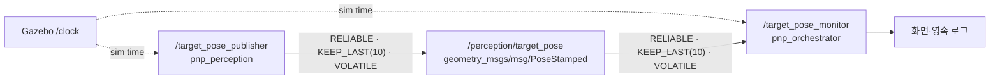
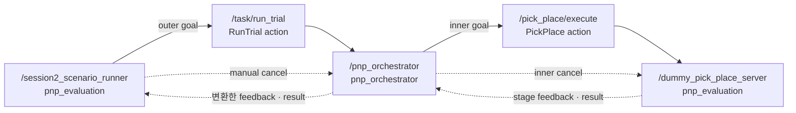

# 시스템 구조와 인터페이스

> 최초 작성: Session 1 (2026-08-04)
>
> 최근 갱신: Session 2 (2026-08-09)
>
> 다음 갱신: Session 3, Session 10
>
> 최종화: Session 12

## 1. 현재 ROS graph



Session 1에서는 카메라와 로봇 팔을 연결하지 않는다. `pnp_perception`의 임시 publisher가 목표 pose를 만들고, `pnp_orchestrator`의 monitor가 같은 메시지를 받아 주요 필드를 출력하는 최소 데이터 흐름만 검증했다.

## 2. 노드 책임

| 노드 | 패키지 | 입력 | 출력 | Session 1 책임 |
|---|---|---|---|---|
| `/target_pose_publisher` | `pnp_perception` | YAML parameter, `/clock` | `/perception/target_pose` | 설정된 좌표로 임시 목표 `PoseStamped` 생성 |
| `/target_pose_monitor` | `pnp_orchestrator` | `/perception/target_pose`, YAML parameter, `/clock` | 화면·영속 로그 | 받은 pose의 frame, timestamp, x·y·z 표시 |

두 노드는 `pnp_bringup/launch/core_skeleton.launch.py`에서 함께 실행하며, 공통 parameter 파일은 `pnp_bringup/config/common.yaml`이다.

## 3. Topic 계약

| Topic | Type | Publisher / Subscriber | QoS | Frame | Timestamp |
|---|---|---|---|---|---|
| `/perception/target_pose` | `geometry_msgs/msg/PoseStamped` | 1 / 1 | reliable, keep last 10, volatile | `world` | Gazebo에서 bridge된 sim time의 현재 시각 |

기본 parameter는 다음과 같다.

| Parameter | 값 | 적용 노드 |
|---|---:|---|
| `use_sim_time` | `true` | publisher, monitor |
| `topic_name` | `/perception/target_pose` | publisher, monitor |
| `publish_rate_hz` | `2.0` | publisher |
| `frame_id` | `world` | publisher |
| `target_x` | `0.16` | publisher |
| `target_y` | `0.0` | publisher |
| `target_z` | `0.12` | publisher |

## 4. Session 1 실행 결과

실행일은 2026-08-04이며, 다음 항목을 확인했다.

- [x] `pnp_perception`, `pnp_orchestrator`, `pnp_bringup`을 build하고 ROS 검색 경로에서 두 executable, bringup package, `params_file` launch argument를 확인했다.
- [x] 기본 좌표 `(0.160, 0.000, 0.120)`에서 `PUBLISH` 819건과 `RECEIVE` 819건이 일치했다.
- [x] YAML의 `target_y`를 `0.05`로 바꾼 좌표 `(0.160, 0.050, 0.120)`에서 `PUBLISH` 43건과 `RECEIVE` 43건이 일치했다.
- [x] source와 install 영역의 YAML을 모두 `target_y: 0.0`으로 복원했다.
- [x] ROS graph는 node/topic CLI 정보로 확인했다. 저장소에 별도 GUI 캡처 파일은 남기지 않았다.
- [x] core launch, clock bridge, Gazebo server, Zenoh router를 종료하고 관련 잔여 프로세스가 없음을 확인했다. container는 `Up` 상태로 유지했다.

영속 로그는 container의 다음 경로에 보존한다.

| 로그 | 크기 / 행 수 | SHA-256 |
|---|---:|---|
| `/workspace/pick_place_ws/session1_core.log` | 11,411,556 bytes / 27,078행 | `e8f35a26afb9c7b61a3a78bb9b5befa4f5a56b0d58192d0d8bc960425230db61` |
| `/workspace/pick_place_ws/session1_yaml_example.log` | 960,489 bytes / 2,252행 | `b97e17b994731ff44908840eb393068d3a997577c5be35865ae11515f45be34a` |

## 5. Session 2 action graph



`RunTrial`은 목표 선택부터 조작 결과 회수까지 전체 작업을 소유하는 outer action이고, `PickPlace`는 조작 단계만 소유하는 inner action이다. Session 2의 정상 실행은 `use_perception=false`와 고정 pose를 사용하므로 `/perception/target_pose`가 없어도 동작한다. `use_perception=true`일 때는 orchestrator가 가장 최근에 받은 perception pose를 목표로 사용할 수 있다.

| 구성 요소 | 입력 | 출력 | Session 2 책임 |
|---|---|---|---|
| `/session2_scenario_runner` | 실행 인자, 고정 object/place pose | `RunTrial` goal·manual cancel | 정상 실행과 취소 시나리오 요청, feedback·result 표시 |
| `/pnp_orchestrator` | `RunTrial` goal, 선택적으로 `/perception/target_pose` | `PickPlace` goal, outer feedback·result | 목표 선택, 상태 전이, inner action 호출, feedback·result·cancel 중계 |
| `/dummy_pick_place_server` | `PickPlace` goal·cancel | 조작 stage feedback·result | 실제 로봇 없이 조작 단계와 cleanup 흐름 재현 |

| Action | Client → Server | Goal의 핵심 필드 | Result / Feedback |
|---|---|---|---|
| `/task/run_trial` (`RunTrial`) | scenario runner → orchestrator | `run_id`, perception 사용 여부, fixed object pose, place pose | 성공 여부·오류 코드·메시지 / outer와 inner stage·진행률 |
| `/pick_place/execute` (`PickPlace`) | orchestrator → dummy server | `run_id`, object·pick·place pose, `pick_only` | 성공 여부·오류 코드·메시지 / 조작 stage·진행률 |

## 6. Session 2 상태 흐름과 cancel 소유권

```text
orchestrator:
IDLE → SELECT_TARGET → TRANSFORM → CALL_PICK_PLACE → DONE | FAILED

dummy manipulation:
IDLE → SETUP_SCENE → APPROACH → GRASP → LIFT
     → TRANSPORT → PLACE → CLEANUP → DONE
```

Manual cancel은 runner가 outer goal에 요청한다. Orchestrator는 outer cancel을 받아 실행 중인 inner goal에 전달하고, dummy server는 현재 단계를 멈춘 뒤 `CLEANUP` feedback과 `CANCELED` result를 반환한다. Orchestrator가 이를 outer `CANCELED` terminal로 마무리하므로 취소 결과의 `success=false`, `error_code=0`은 실행 오류가 아니라 요청된 작업을 끝까지 완료하지 않았다는 뜻이다.

## 7. Session 2 실행 결과

실행일은 2026-08-09이며, 다음 항목을 확인했다.

- [x] `pnp_interfaces`, `pnp_orchestrator`, `pnp_evaluation` 세 package를 clean build하고 `RunTrial`, `PickPlace` interface를 확인했다.
- [x] 정상 goal에서 outer stage와 inner 조작 stage feedback이 이어지고 최종 `RESULT status=SUCCEEDED success=true error_code=0`이 반환됐다.
- [x] 0.8초 뒤 manual cancel을 보내 `GRASP → CLEANUP` 뒤 `RESULT status=CANCELED success=false error_code=0 message=manual cancel completed`가 반환됐다.
- [x] Session 1 orchestrator 백업에는 `COLCON_IGNORE`를 두어 colcon이 동일한 package 이름을 중복 발견하지 않도록 했다.

영속 로그는 container의 다음 경로에 보존한다.

- `/workspace/pick_place_ws/session2_dummy.log`
- `/workspace/pick_place_ws/session2_orchestrator.log`
- `/workspace/pick_place_ws/session2_normal.log`
- `/workspace/pick_place_ws/session2_manual_cancel.log`

현재 inner server는 상태 전달 학습용 dummy이며 실제 관절을 움직이지 않는다. 실제 조작은 Session 4에서 MoveIt 기반 server로 교체한다.

## 8. 이후 회차에서 추가할 항목

- Session 3: controller와 상위 launch 연결, 실제 robot graph, TF 책임
- Session 10: 실제 node 연결, 최소 오류 코드와 cleanup 흐름
- Session 12: 최종 구조, 재현 명령과 Known issues 확정
