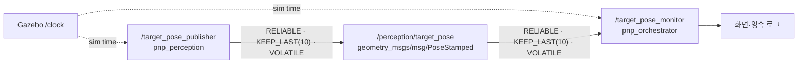

# 시스템 구조와 인터페이스

> 최초 작성: Session 1 (2026-08-04)
>
> 갱신 예정: Session 2, Session 3, Session 10
>
> 최종화: Session 12

## 1. 현재 ROS graph

Session 1에서는 카메라와 로봇 팔을 연결하지 않는다. `pnp_perception`의 임시 publisher가 목표 pose를 만들고, `pnp_orchestrator`의 monitor가 같은 메시지를 받아 주요 필드를 출력하는 최소 데이터 흐름만 검증했다.

## 2. 노드 책임

| 노드 | 패키지 | 입력 | 출력 | Session 1 책임 |
|---|---|---|---|---|
| `/target_pose_publisher` | `pnp_perception` | YAML parameter, `/clock` | `/perception/target_pose` | 설정된 좌표로 임시 목표 `PoseStamped` 생성 |
| `/target_pose_monitor` | `pnp_orchestrator` | `/perception/target_pose`, YAML parameter, `/clock` | 화면·영속 로그 | 받은 pose의 frame, timestamp, x·y·z 표시 |

두 노드는 `pnp_bringup/launch/core_skeleton.launch.py`에서 함께 실행하며, 공통 parameter 파일은 `pnp_bringup/config/common.yaml`이다.

## 3. Topic 계약

| Topic | Type | Publisher / Subscriber | QoS | Frame | Timestamp |
|---|---|---|---|---|---|
| `/perception/target_pose` | `geometry_msgs/msg/PoseStamped` | 1 / 1 | reliable, keep last 10, volatile | `world` | Gazebo에서 bridge된 sim time의 현재 시각 |

기본 parameter는 다음과 같다.

| Parameter | 값 | 적용 노드 |
|---|---:|---|
| `use_sim_time` | `true` | publisher, monitor |
| `topic_name` | `/perception/target_pose` | publisher, monitor |
| `publish_rate_hz` | `2.0` | publisher |
| `frame_id` | `world` | publisher |
| `target_x` | `0.16` | publisher |
| `target_y` | `0.0` | publisher |
| `target_z` | `0.12` | publisher |

## 4. Session 1 실행 결과

실행일은 2026-08-04이며, 다음 항목을 확인했다.

- [x] `pnp_perception`, `pnp_orchestrator`, `pnp_bringup`을 build하고 ROS 검색 경로에서 두 executable, bringup package, `params_file` launch argument를 확인했다.
- [x] 기본 좌표 `(0.160, 0.000, 0.120)`에서 `PUBLISH` 819건과 `RECEIVE` 819건이 일치했다.
- [x] YAML의 `target_y`를 `0.05`로 바꾼 좌표 `(0.160, 0.050, 0.120)`에서 `PUBLISH` 43건과 `RECEIVE` 43건이 일치했다.
- [x] source와 install 영역의 YAML을 모두 `target_y: 0.0`으로 복원했다.
- [x] ROS graph는 node/topic CLI 정보로 확인했다. 저장소에 별도 GUI 캡처 파일은 남기지 않았다.
- [x] core launch, clock bridge, Gazebo server, Zenoh router를 종료하고 관련 잔여 프로세스가 없음을 확인했다. container는 `Up` 상태로 유지했다.

영속 로그는 container의 다음 경로에 보존한다.

| 로그 | 크기 / 행 수 | SHA-256 |
|---|---:|---|
| `/workspace/pick_place_ws/session1_core.log` | 11,411,556 bytes / 27,078행 | `e8f35a26afb9c7b61a3a78bb9b5befa4f5a56b0d58192d0d8bc960425230db61` |
| `/workspace/pick_place_ws/session1_yaml_example.log` | 960,489 bytes / 2,252행 | `b97e17b994731ff44908840eb393068d3a997577c5be35865ae11515f45be34a` |

## 5. 이후 회차에서 추가할 항목

- Session 2: action, 3층 상태기계, cancel/timeout, `/task/status`, 오류 코드 초안
- Session 3: controller와 상위 launch 연결, 실제 robot graph, TF 책임
- Session 10: 최종 상태 전이도, 오류 코드, retry·cleanup 경계
- Session 12: 최종 구조, 재현 명령과 Known issues 확정
