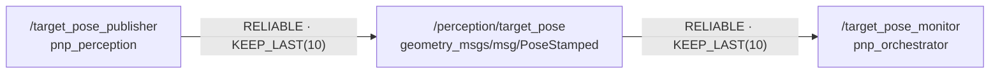

# 시스템 구조와 인터페이스

> 최초 작성: Session 1
>
> 갱신 예정: Session 2, Session 3, Session 10
>
> 최종화: Session 12

## 1. 현재 ROS graph

## 2. 노드 책임

| 노드 | 패키지 | 입력 | 출력 | 현재 책임 |
|---|---|---|---|---|
| `/target_pose_publisher` | `pnp_perception` | YAML parameter, `/clock` | `/perception/target_pose` | 임시 목표 pose 생성 |
| `/target_pose_monitor` | `pnp_orchestrator` | `/perception/target_pose`, YAML parameter | 로그 | 받은 pose의 주요 필드 표시 |

## 3. topic 계약

| topic | type | QoS | frame | timestamp |
|---|---|---|---|---|
| `/perception/target_pose` | `geometry_msgs/msg/PoseStamped` | reliable, keep last 10, volatile | `world` | sim time의 현재 시각 |

## 4. 현재 데이터 예제

- publisher는 `common.yaml`의 frame, 좌표, 발행 주기를 읽는다.
- publisher와 monitor는 같은 `/perception/target_pose` topic과 QoS를 사용한다.
- monitor는 받은 `PoseStamped`의 frame, timestamp, x·y·z 좌표를 로그로 보여 준다.

## 5. Session 1 결과 기록

- 기본 pose: `[ ] PUBLISH와 RECEIVE 확인`
- YAML 좌표 변경: `[ ] 변경한 y 좌표가 양쪽 로그에 반영됨을 확인`
- ROS graph 캡처: `TODO: 파일 또는 링크`
- 재현 담당/날짜: `TODO`

## 6. 이후 회차에서 추가할 항목

- Session 2: 두 action, 간단한 상태 흐름, manual cancel, 최소 오류 코드
- Session 3: controller와 상위 launch 연결, 실제 ROS graph
- Session 10: 실제 노드 상태 흐름, 대표 `TARGET_UNAVAILABLE`, cleanup
- Session 12: 최종 구조와 재현 명령
