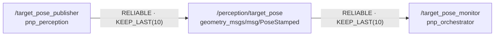

# 시스템 구조와 인터페이스

> 최초 작성: Session 1
>
> 갱신 예정: Session 2, Session 3, Session 10
>
> 최종화: Session 12

## 1. 현재 ROS graph

## 2. 노드 책임

| 노드 | 패키지 | 입력 | 출력 | 현재 책임 |
|---|---|---|---|---|
| `/target_pose_publisher` | `pnp_perception` | YAML parameter, `/clock` | `/perception/target_pose` | 임시 목표 pose 생성 |
| `/target_pose_monitor` | `pnp_orchestrator` | `/perception/target_pose`, YAML parameter, `/clock` | 로그 | frame·timestamp·workspace 검사 |

## 3. topic 계약

| topic | type | QoS | frame | timestamp |
|---|---|---|---|---|
| `/perception/target_pose` | `geometry_msgs/msg/PoseStamped` | reliable, keep last 10, volatile | `world` | sim time의 현재 시각 |

## 4. 현재 검증 규칙

- frame은 `expected_frame`과 같아야 한다.
- timestamp age는 `max_age_sec` 이하여야 한다.
- x, y, z는 `common.yaml`의 workspace 범위 안이어야 한다.
- 위 조건을 모두 만족하면 `ACCEPT`, 하나라도 어기면 이유를 포함한 `REJECT` 로그를 남긴다.

## 5. Session 1 결과 기록

- 정상 pose: `[ ] ACCEPT 확인`
- 잘못된 frame: `[ ] FRAME_MISMATCH 확인`
- 오래된 timestamp: `[ ] STALE_TIMESTAMP 확인`
- YAML workspace 변경: `[ ] OUT_OF_WORKSPACE 확인 후 원복`
- ROS graph 캡처: `TODO: 파일 또는 링크`
- 재현 담당/날짜: `TODO`

## 6. 이후 회차에서 추가할 항목

- Session 2: action, 3층 상태기계, cancel/timeout, `/task/status`, 오류 코드 초안
- Session 3: controller와 상위 launch 연결, 실제 ROS graph
- Session 10: 최종 상태 전이도, 오류 코드, retry·cleanup 경계
- Session 12: 최종 구조와 재현 명령
