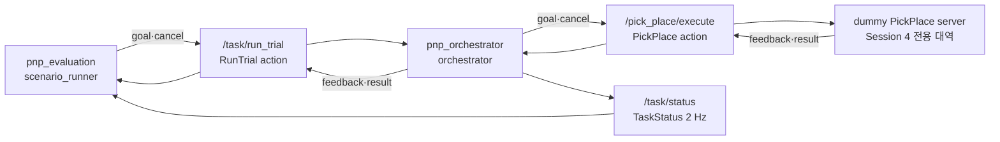

## Session 2 action과 상태기계 골격

> 아래 `TODO`는 Session 2를 실제 실행한 뒤 확인한 값으로 교체한다.



### 상태 소유권

```text
evaluation:   VALIDATE_PROFILE → ALLOCATE_ATTEMPT → RESET
              → CALL_RUN_TRIAL → COLLECT → SCORE → RECORD
orchestrator: SELECT_TARGET → (LOAD_FIXED_TARGET | DETECT → TRANSFORM)
              → VALIDATE → CALL_MANIPULATION → COMPLETE
manipulation: IDLE → SETUP_SCENE → PLAN_PICK → EXECUTE_PICK
              → PREPARE_TRANSPORT → ATTACH_OBJECT → LIFT → VERIFY_PICK
              → (PICK_LIFT_ONLY | PLAN_PLACE → EXECUTE_PLACE)
              → CLEANUP → RETURN_RESULT
```

- evaluator만 profile 검증·attempt 할당·reset·채점을 소유한다.
- orchestrator만 target 선택·outer action·`/task/status`를 소유한다.
- manipulation만 planning·motion·scene cleanup을 소유한다.
- Session 2의 inner server는 로봇을 움직이지 않는 dummy이며 Session 4 구현을 대신하지 않는다.

### cancel·timeout 계약

| 항목 | 설정 / 확인 결과 |
|---|---|
| `task_status_rate_hz` / `task_status_timeout_s` | 기본 `2.0 Hz` / `2.0 s` |
| `pick_place_action_timeout_s` | 기본 `15.0 s`, steady-clock watchdog |
| `pick_place_cancel_timeout_s` | 기본 `5.0 s` |
| `run_trial_cancel_timeout_s` | 기본 `7.0 s` |
| `cancel_propagation_margin_s` | 기본 `2.0 s` |
| timeout 불변식 | `run_trial >= pick_place + margin` |
| manual cancel | TODO: inner terminal → outer terminal 순서와 `TASK_CANCELED` 확인 |
| action timeout | TODO: confirmed cancel 뒤 initiating `EXECUTION_TIMEOUT` 유지 확인 |
| heartbeat timeout | TODO: effective `TASK_HEARTBEAT_TIMEOUT`과 terminal 확인 |
| inner terminal 미확인 | TODO: `run_trial_result_received=false`, `SAFE_STOP`, 새 goal 거부 확인 |

### 실행 증빙

- `FULL_PICK_PLACE` 성공 mask: TODO
- `PICK_LIFT_ONLY` 성공 mask와 `PLACE` 미도달: TODO
- 코드화된 실패의 `trial_completed` / `pipeline_success` / error code: TODO
- `/task/status` 측정 rate와 증가한 `heartbeat_seq`: TODO
- 실제 로그 경로와 SHA-256: TODO
