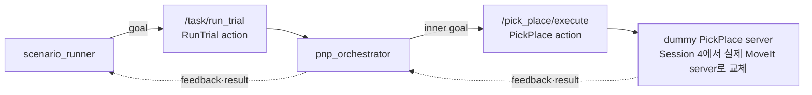

## Session 2 — 간소화한 action과 상태 흐름



### 상태 흐름

```text
orchestrator:
IDLE → SELECT_TARGET → TRANSFORM → CALL_PICK_PLACE → DONE | FAILED

dummy manipulation:
IDLE → SETUP_SCENE → APPROACH → GRASP → LIFT
     → TRANSPORT → PLACE → CLEANUP → DONE
```

### Session 2에서 확인한 것

- [ ] normal goal이 outer action에서 inner action으로 전달됨
- [ ] stage feedback과 최종 `SUCCEEDED` result가 보임
- [ ] manual cancel 1회가 inner와 outer의 `CANCELED` terminal로 이어짐

heartbeat·watchdog·timeout 경계·invalid profile/scope·`SAFE_STOP` fault injection은 본과정에서 수행하지 않는다. 실제 로봇 동작은 Session 4에서 dummy server를 교체하며 연결한다.
