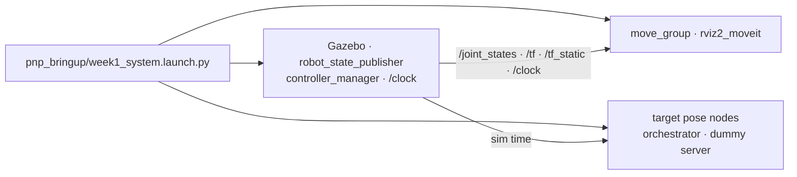

## Session 3 — 상위 launch와 실행 graph

### 실행 확인

- [ ] `world:=empty_world`를 상위 launch가 공식 Gazebo launch에 전달함
- [ ] `use_sim:=true`가 공식 MoveIt launch에 전달됨
- [ ] `joint_state_broadcaster`, `arm_controller`, `gripper_controller`가 모두 `active`
- [ ] `world → end_effector_link` TF가 연결됨
- [ ] 네 project node의 `use_sim_time`이 모두 `true`
- [ ] 정상 `RunTrial → PickPlace` action이 상위 launch 안에서도 `SUCCEEDED`로 끝남

실제 실행 출력과 사용한 world 이름을 확인한 뒤 체크하고 `docs/system_architecture.md`에 반영합니다.
